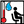

#### Component list:
*  [Analysis Period](../components/Analysis_Period.md)
*  [Average Data](../components/Average_Data.md)
*  [Branch Data](../components/Branch_Data.md)
*  [Separate data](../components/Separate_data.md)
*  [CDD_HDD](../components/CDD_HDD.md)
*  [Wind Speed Calculator](../components/Wind_Speed_Calculator.md)
*  [Adaptive Comfort Calculator](../components/Adaptive_Comfort_Calculator.md)
*  [Body Characteristics](../components/Body_Characteristics.md)
*  [Outdoor Comfort Calculator](../components/Outdoor_Comfort_Calculator.md)
*  [PMV Comfort Calculator](../components/PMV_Comfort_Calculator.md)
*  [Thermal Comfort Indices](../components/Thermal_Comfort_Indices.md)
*  [CDH_HDH](../components/CDH_HDH.md)
*  [Clothing Function](../components/Clothing_Function.md)
*  [Humidity Ratio Calculator](../components/Humidity_Ratio_Calculator.md)