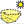

#### Component list:
*  [Radiation Analysis](../components/Radiation_Analysis.md)
*  [SolarEnvelopeBasic](../components/SolarEnvelopeBasic.md)
*  [SolarFanBasic](../components/SolarFanBasic.md)
*  [Sunlight Hours Analysis](../components/Sunlight_Hours_Analysis.md)
*  [Bounce from Surface](../components/Bounce_from_Surface.md)
*  [View Analysis](../components/View_Analysis.md)
*  [View From Sun](../components/View_From_Sun.md)
*  [view Rose](../components/view_Rose.md)
*  [Comfort Shade Benefit Evaluator](../components/Comfort_Shade_Benefit_Evaluator.md)
*  [ShadingDesigner](../components/ShadingDesigner.md)
*  [SolarFan](../components/SolarFan.md)
*  [Forward Raytracing](../components/Forward_Raytracing.md)