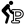

#### Component list:
*  [Mesh-To-Hatch](../components/Mesh-To-Hatch.md)
*  [North](../components/North.md)
*  [Recolor_Mesh](../components/Recolor_Mesh.md)
*  [True_North](../components/True_North.md)
*  [Adaptive_Comfort_Parameters](../components/Adaptive_Comfort_Parameters.md)
*  [Body_Characteristics](../components/Body_Characteristics.md)
*  [Gradient_Library](../components/Gradient_Library.md)
*  [Legend_Parameters](../components/Legend_Parameters.md)
*  [PMV_Comfort_Parameters](../components/PMV_Comfort_Parameters.md)
*  [Passive_Strategy_List](../components/Passive_Strategy_List.md)
*  [Real_Time_Radiation_Analysis](../components/Real_Time_Radiation_Analysis.md)
*  [Capture_View](../components/Capture_View.md)
*  [Orient_to_Camera](../components/Orient_to_Camera.md)
*  [Set_the_View](../components/Set_the_View.md)
*  [fly](../components/fly.md)
*  [C2F](../components/C2F.md)
*  [DOY_HOY](../components/DOY_HOY.md)
*  [Day_Month_Hour](../components/Day_Month_Hour.md)
*  [F2C](../components/F2C.md)
*  [Activities_Met_List](../components/Activities_Met_List.md)
*  [BTU2Wh](../components/BTU2Wh.md)
*  [CombineSolarEnvelopes](../components/CombineSolarEnvelopes.md)
*  [Comfort_Mannequin](../components/Comfort_Mannequin.md)
*  [Construct_Time](../components/Construct_Time.md)
*  [Create_Legend](../components/Create_Legend.md)
*  [L2G](../components/L2G.md)
*  [Orientation_Study_Parameters](../components/Orientation_Study_Parameters.md)
*  [Passive_Strategy_Parameters](../components/Passive_Strategy_Parameters.md)
*  [Shading_Parameters_List](../components/Shading_Parameters_List.md)
*  [Wh2BTU](../components/Wh2BTU.md)
*  [Wh2kWh](../components/Wh2kWh.md)
*  [kWh2Wh](../components/kWh2Wh.md)
*  [ms2mph](../components/ms2mph.md)
*  [rIP2rSI](../components/rIP2rSI.md)
*  [uIP2uSI](../components/uIP2uSI.md)