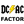
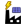
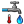

#### Component list:
*  [Photovoltaics_Surface](../components/Photovoltaics_Surface.md)
*  [Solar_Water_Heating_Surface](../components/Solar_Water_Heating_Surface.md)
*  [DC_to_AC_derate_factor](../components/DC_to_AC_derate_factor.md)
*  [Photovoltaics_Module](../components/Photovoltaics_Module.md)
*  [Photovoltaics_Performance_Metrics](../components/Photovoltaics_Performance_Metrics.md)
*  [Simplified_Photovoltaics_Module](../components/Simplified_Photovoltaics_Module.md)
*  [Sunpath_Shading](../components/Sunpath_Shading.md)
*  [Tilt_And_Orientation_Factor](../components/Tilt_And_Orientation_Factor.md)
*  [Cold_Water_Temperature](../components/Cold_Water_Temperature.md)
*  [Commercial_Public_Apartment_Hot_Water](../components/Commercial_Public_Apartment_Hot_Water.md)
*  [Residential_Hot_Water](../components/Residential_Hot_Water.md)
*  [Solar_Water_Heating_Performance_Metrics](../components/Solar_Water_Heating_Performance_Metrics.md)
*  [Solar_Water_Heating_System](../components/Solar_Water_Heating_System.md)
*  [Solar_Water_Heating_System_Detailed](../components/Solar_Water_Heating_System_Detailed.md)
*  [Import_CEC_Photovoltaics_Module](../components/Import_CEC_Photovoltaics_Module.md)
*  [Import_Sandia_Photovoltaics_Module](../components/Import_Sandia_Photovoltaics_Module.md)
*  [PV_SWH_System_Size](../components/PV_SWH_System_Size.md)