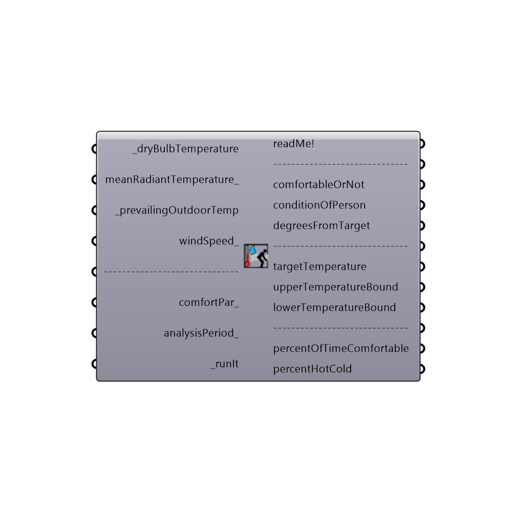

## Adaptive Comfort Calculator []

Use this component to calculate the adaptive comfort for a given set of input conditions.
 This component will output a stream of 0's and 1's indicating whether certain conditions are comfortable given the prevailing mean monthly temperature that ocuppants tend to adapt themselves to.
 This component will also output a series of interger numbers that indicate the following: -1 = The average monthly temperature is too extreme for the adaptive model. 0 = The input conditions are too cold for occupants. 1 = The input conditions are comfortable for occupants. 2 = The input conditions are too hot for occupants.
 Lastly, this component outputs the percent of time comfortable, hot, cold and monthly extreme as well as a lit of numbers indicating the upper temperature of comfort and lower temperature of comfort.
 _
 The adaptive comfort model was created in response to the shortcomings of the PMV model that became apparent when it was applied to buildings without air conditioning.  Namely, the PMV model was over-estimating the discomfort of occupants in warm conditions of nautrally ventilated buildings.
 Accordingly, the adaptive comfort model was built on the work of hundreds of field studies in which people in naturally ventilated buildings were asked asked about how comfortable they were.
 Results showed that users tended to adapt themselves to the monthly mean temperature and would be comfortable in buildings so long as the building temperature remained around a value close to that monthly mean.  This situation held true so long as the monthly mean temperature remained above 10 C and below 33.5 C.
 _
 The comfort models that make this component possible were translated to python from a series of validated javascript comfort models coded at the Berkely Center for the Built Environment (CBE).  The Adaptive model used by both the CBE Tool and this component was originally published in ASHARAE 55.
 Special thanks goes to the authors of the online CBE Thermal Comfort Tool who first coded the javascript: Hoyt Tyler, Schiavon Stefano, Piccioli Alberto, Moon Dustin, and Steinfeld Kyle. http://cbe.berkeley.edu/comforttool/
 -
 

#### Inputs
* ##### _dryBulbTemperature [Required]
A number representing the dry bulb temperature of the air in degrees Celcius.  This input can also accept a list of temperatures representing conditions at different times or the direct output of dryBulbTemperature from the Import EPW component.
* ##### meanRadiantTemperature_ [Optional]
A number representing the mean radiant temperature of the surrounding surfaces in degrees Celcius.  If no value is plugged in here, this component will assume that the mean radiant temperature is equal to air temperature value above.  This input can also accept a list of temperatures representing conditions at different times or the direct output of dryBulbTemperature from the Import EPW component.
* ##### _prevailingOutdoorTemp [Required]
A number representing the average monthly outdoor temperature in degrees Celcius.  This average monthly outdoor temperature is the temperature that occupants in naturally ventilated buildings tend to adapt themselves to. For this reason, this input can also accept the direct output of dryBulbTemperature from the Import EPW component if houlry values for the full year are connected for the other inputs of this component.
* ##### windSpeed_ [Optional]
A number representing the wind speed of the air in meters per second.  If no value is plugged in here, this component will assume a very low wind speed of 0.3 m/s, characteristic of most naturally ventilated buildings.  This input can also accept a list of wind speeds representing conditions at different times or the direct output of windSpeed from of the Import EPW component.
* ##### ------------------------------ []
...
* ##### comfortPar_ [Optional]
Optional comfort parameters from the "Ladybug_Adaptive Comfort Parameters" component.  Use this to select either the US or European comfort model, set the threshold of acceptibility for comfort or compute prevailing outdoor temperature by a monthly average or running mean.  These comfortPar can also be used to set a levelOfConditioning, which makes use of research outside of the official published standards that surveyed people in air conditioned buildings.
* ##### analysisPeriod_ [Optional]
An optional analysis period from the Analysis Period component.  If no Analysis period is given and epw data from the ImportEPW component has been connected, the analysis will be run for the enitre year.
* ##### _runIt [Required]
Set to "True" to run the component and calculate the adaptive comfort metrics.

#### Outputs
* ##### readMe!
...
* ##### ------------------------------
...
* ##### comfortableOrNot
A stream of 0's and 1's (or "False" and "True" values) indicating whether occupants are comfortable under the input conditions given the fact that these occupants tend to adapt themselves to the prevailing mean monthly temperature. 0 indicates that a person is not comfortable while 1 indicates that a person is comfortable.
* ##### conditionOfPerson
A stream of interger values from -1 to +1 that correspond to each hour of the input data and indicate the following: -1 = The input conditions are too cold for occupants. 0 = The input conditions are comfortable for occupants. +1 = The input conditions are too hot for occupants.
* ##### degreesFromTarget
A stream of temperature values in degrees Celcius indicating how far from the target temperature the conditions of the people are.  Positive values indicate conditions hotter than the target temperature while negative values indicate degrees below the target temperture.
* ##### ------------------------------
Script variable AdaptiveComfortCalculator
* ##### targetTemperature
A stream of temperature values in degrees Celcius indicating the mean target temperture or neutral temperature that the most people will find comfortable.
* ##### upperTemperatureBound
A stream of temperature values in degrees Celcius indicating the highest possible temperature in the comfort range for each hour of the input conditions.
* ##### lowerTemperatureBound
A stream of temperature values in degrees Celcius indicating the lowest possible temperature in the comfort range for each hour of the input conditions.
* ##### ------------------------------
Script variable AdaptiveComfortCalculator
* ##### percentOfTimeComfortable
The percent of the input data for which the occupants are comfortable.  Comfortable conditions are when the indoor temperature is within the comfort range determined by the prevailing outdoor temperature.
* ##### percentHotCold
A list of 2 numerical values indicating the following: 0) The percent of the input data for which the occupants are too hot.  1) The percent of the input data for which the occupants are too cold.

[Check Hydra Example Files for Adaptive Comfort Calculator](https://hydrashare.github.io/hydra/index.html?keywords=Ladybug_Adaptive Comfort Calculator)