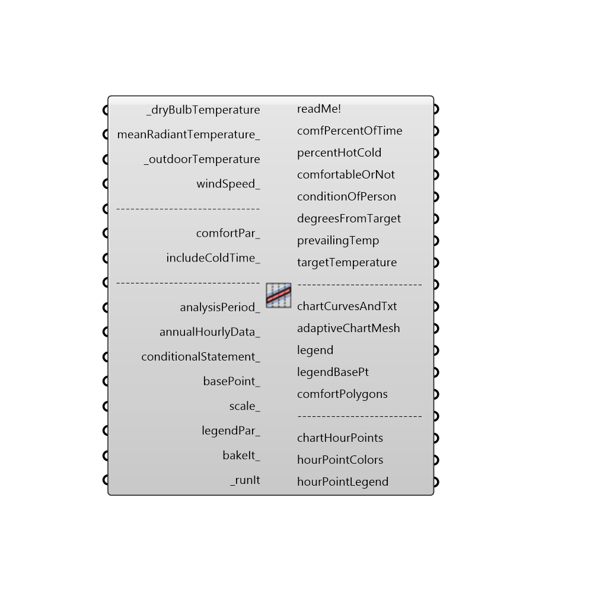

##  Adaptive Comfort Chart

Use this component to calculate the adaptive comfort for a given set of input conditions.
 This component will output a stream of 0's and 1's indicating whether certain conditions are comfortable given the prevailing mean monthly temperature that ocuppants tend to adapt themselves to.
 This component will also output a series of interger numbers that indicate the following: -1 = The average monthly temperature is too extreme for the adaptive model. 0 = The input conditions are too cold for occupants. 1 = The input conditions are comfortable for occupants. 2 = The input conditions are too hot for occupants.
 Lastly, this component outputs the percent of time comfortable, hot, cold and monthly extreme as well as a lit of numbers indicating the upper temperature of comfort and lower temperature of comfort.
 _
 The adaptive comfort model was created in response to the shortcomings of the PMV model that became apparent when it was applied to buildings without air conditioning.  Namely, the PMV model was over-estimating the discomfort of occupants in warm conditions of nautrally ventilated buildings.
 Accordingly, the adaptive comfort model was built on the work of hundreds of field studies in which people in naturally ventilated buildings were asked asked about how comfortable they were.
 Results showed that users tended to adapt themselves to the monthly mean temperature and would be comfortable in buildings so long as the building temperature remained around a value close to that monthly mean.  This situation held true so long as the monthly mean temperature remained above 10 C and below 33.5 C.
 _
 The comfort models that make this component possible were translated to python from a series of validated javascript comfort models coded at the Berkely Center for the Built Environment (CBE).  The Adaptive model used by both the CBE Tool and this component was originally published in ASHARAE 55.
 Special thanks goes to the authors of the online CBE Thermal Comfort Tool who first coded the javascript: Hoyt Tyler, Schiavon Stefano, Piccioli Alberto, Moon Dustin, and Steinfeld Kyle. http://cbe.berkeley.edu/comforttool/
 -
 

#### Inputs
* ##### dryBulbTemperature [Required]
A number representing the dry bulb temperature of the air in degrees Celcius.  This input can also accept a list of temperatures representing conditions at different times or the direct output of dryBulbTemperature from the 'Read EP Result' or 'Import EPW' component.
* ##### meanRadiantTemperature [Optional]
A number representing the mean radiant temperature of the surrounding surfaces in degrees Celcius.  If no value is plugged in here, this component will assume that the mean radiant temperature is equal to air temperature value above.  This input can also accept a list of temperatures representing conditions at different times or the direct output from the 'Read EP Result' or 'Import EPW' component.
* ##### prevailingOutdoorTemp [Required]
A number representing the prevailing outdoor temperature in degrees Celcius.  For the ASHRAE standard, this is the average monthly outdoor temperature and, for the European standard, this is a running mean outdoor temperature calculated from the conditions of the last week.  For this reason, this input can also accept the direct output of dryBulbTemperature from the 'Import EPW' component if houlry values for the full year are connected for the other inputs of this component.  This input from the 'Import EPW' component is recommended.
* ##### windSpeed [Optional]
A number representing the wind speed of the air in meters per second.  If no value is plugged in here, this component will assume a low wind speed of < 0.2 m/s, characteristic of most naturally ventilated buildings without fans.  This input can also accept several wind speeds to generate multiple comfort polygons.  Lastly, this component can accept the direct output of windSpeed from of the Import EPW component and, from this data, two comfort polygons will be drawn representing the maximum and minumu wind speed.
* ##### comfortPar [Optional]
Optional comfort parameters from the "Ladybug_Adaptive Comfort Parameters" component.  Use this to select either the US or European comfort model, set the threshold of acceptibility for comfort or compute prevailing outdoor temperature by a monthly average or running mean.  These comfortPar can also be used to set a levelOfConditioning, which makes use of research outside of the official published standards that surveyed people in air conditioned buildings.
* ##### includeColdTime [Optional]
Set to "True" to have the component include the time period where the outdoor temperature is too cold for the official ASHRAE or European standard and set to "False" to exclude it.  When the outdoor temperatue is too cold for these standards, a correlation from recent research is used.  The default is set to "True" to include the cold period in the visualization and output.
* ##### analysisPeriod [Optional]
An optional analysis period from the Analysis Period component.  If no Analysis period is given and epw or energy simulation data has been connected, the analysis will be run for the enitre year.
* ##### annualHourlyData [Optional]
An optional list of hourly data from the 'Import EPW' component, which will be used to create hourPointColors that correspond to the hours of the data (e.g. windSpeed).  You can connect up several different annualHourly data here.
* ##### conditionalStatement [Optional]
This input allows users to remove data that does not fit specific conditions or criteria from the adaptive chart. The conditional statement input here should be a valid condition statement in Python, such as "a>25" or "b<80" (without quotation marks).
 The current version of this component accepts "and" and "or" operators. To visualize the hourly data, only lowercase English letters should be used as variables, and each letter alphabetically corresponds to each of the lists (in their respective order): "a" always represents the 1st list plugged into annualHourlyData_, "b" always represents the 2nd list plugged into annualHourlyData_, "c" always represents the 3rd list plugged into annualHourlyData_, etc.
 For example, if you want to plot the data for the time period when temperature is between 18C and 23C, and humidity is less than 80%, the conditional statement should be written as “18<a<23 and b<80” (without quotation marks).
* ##### basePoint [Optional]
An optional base point that will be used to place the adaptive chart in the Rhino scene.  If no base point is provided, the base point will be the Rhino model origin.
* ##### scale [Optional]
An optional number to change the scale of the adaptive chart in the Rhino scene.  By default, this value is set to 1.
* ##### legendPar [Optional]
Optional legend parameters from the Ladybug Legend Parameters component.
* ##### runIt [Required]
Set to "True" to run the component and generate an Adaptive comfort chart.

#### Outputs
* ##### readMe!
...
* ##### comfPercentOfTime
The percent of the input data for which the occupants are comfortable.  Comfortable conditions are when the indoor temperature is within the comfort range determined by the prevailing outdoor temperature.
* ##### percentHotCold
A list of 2 numerical values indicating the following: 0) The percent of the input data for which the occupants are too hot.  1) The percent of the input data for which the occupants are too cold.
* ##### comfortableOrNot
A stream of 0's and 1's (or "False" and "True" values) indicating whether occupants are comfortable under the input conditions given the fact that these occupants tend to adapt themselves to the prevailing mean monthly temperature. 0 indicates that a person is not comfortable while 1 indicates that a person is comfortable.
* ##### conditionOfPerson
A stream of interger values from -1 to +1 that correspond to each hour of the input data and indicate the following: -1 = The input conditions are too cold for occupants. 0 = The input conditions are comfortable for occupants. +1 = The input conditions are too hot for occupants.
* ##### degreesFromTarget
A stream of temperature values in degrees Celcius indicating how far from the target temperature the conditions of the people are.  Positive values indicate conditions hotter than the target temperature while negative values indicate degrees below the target temperture.
* ##### chartCurvesAndTxt
The chart curves and text labels of the adaptive chart.
* ##### adaptiveChartMesh
A colored mesh showing the number of input hours happen in each part of the adaptive chart.
* ##### legend
A colored legend showing the number of hours that correspond to each color.
* ##### legendBasePt
The legend base point, which can be used to move the legend in relation to the chart with the grasshopper "move" component.
* ##### comfortPolygons
A brep representing the range of comfort for.
* ##### chartHourPoints
Points representing each of the hours of input temperature and opTemperity ratio.  By default, this ouput is hidden and, to see it, you should connect it to a Grasshopper preview component.
* ##### hourPointColors
Colors that correspond to the chartHourPoints above and can be hooked up to the "Swatch" input of a Grasshopper Preview component that has the hour points above connected as geometry.  By default, points are colored red if they lie inside comfort polygon and are colored blue if they do not meet such comfort criteria.  In the event that you have hooked up annualHourlyData_ this output will be a grafted list of colors.  The first list corresponds to the comfort conditions while the second list colors points based on the annualHourlyData.
* ##### hourPointLegend
A legend that corresponds to the hour point colors above.  In the event that annualHourlyData_ is connected, this output will be a grafted list of legends that each correspond to the grafted lists of colors.

[Check Hydra Example Files for Adaptive Comfort Chart](https://hydrashare.github.io/hydra/index.html?keywords=Ladybug_Adaptive Comfort Chart)