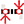
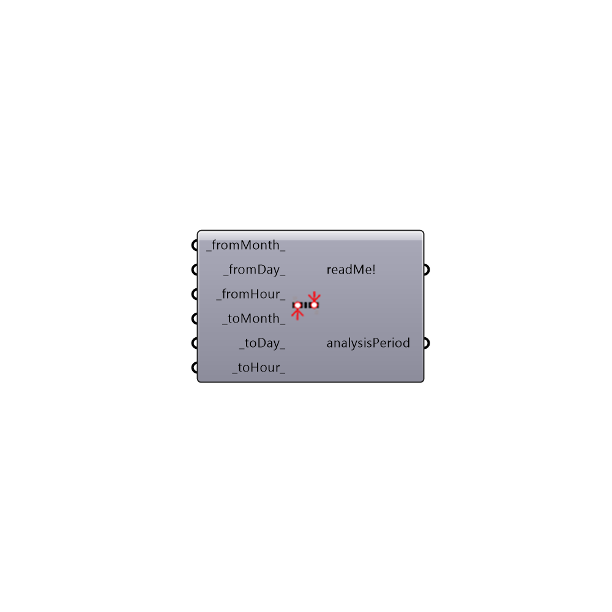

##  Analysis Period

Use this component to set an analysis period, which can be used as input for a variety of other Ladybug and Honeybee components.  Default analysis period without any inputs is set to the entire year.
 -
 

#### Inputs
* ##### fromMonth [Default]
A number between 1 and 12 that represents the month of the year for the start of the analysis.  Default starting month is set to 1 (January).
* ##### fromDay [Default]
A number between 1 and 31 that represents the day of the month for the start of the analysis. Default starting day is set to 1 (the first of the month).
* ##### fromHour [Default]
A number between 1 and 24 that represents the hour of the day for the start of the analysis. Default starting hour is set to 1 (the first hour of the day after midnight).
* ##### toMonth [Default]
A number between 1 and 12 that represents the month of the year for the end of the analysis. Default end month is set to 12 (December).
* ##### toDay [Default]
A number between 1 and 31 that represents the day of the month for the end of the analysis.  Default end day is set to 31 (the 31st of the month).
* ##### toHour [Default]
A number between 1 and 24 that represents the hour of the day for the end of the analysis. Default end hour is set to 24 (the last hour of the day before midnight)

#### Outputs
* ##### readMe!
A text confirmation of the analysis period.
* ##### analysisPeriod
Two tuples that represent the running period
 (fromMonth, fromDay, fromHour) to (toMonth, toDay, toHour)

[Check Hydra Example Files for Analysis Period](https://hydrashare.github.io/hydra/index.html?keywords=Ladybug_Analysis Period)