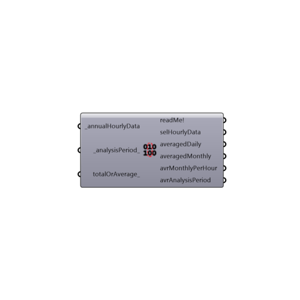

##  Average Data

Use this component to select the data out of an annual hourly data stream (from the importEPW component) using the "Analysis Period" component.
 This componenent also averages or totals the connected hourly data for each day, month, and average hour of each month in the analysis period.
 -
 

#### Inputs
* ##### annualHourlyData [Required]
An hourly data stream from the "Import epw" component.
* ##### analysisPeriod [Default]
The "analysisPeriod" Output from "Analysis Period" component. If no input is provided, the default analysis period is set to the whole year.
* ##### totalOrAverage [Optional]
Set to 'True' to have the component total the values for the given periods and set to 'False' to have the component average them.  The default is set to 'False' to average data.

#### Outputs
* ##### readMe!
A text confirmation of the analysis period.
* ##### selHourlyData
The hourly data stream for the analysis period.
* ##### averagedDaily
The averaged data for each day during the analysis period.
* ##### averagedMonthly
The averaged data for each month during the analysis period.
* ##### avrMonthlyPerHour
The data for the average hour of each month during the analysis period.
* ##### avrAnalysisPeriod
The averaged data for the analysis period.

[Check Hydra Example Files for Average Data](https://hydrashare.github.io/hydra/index.html?keywords=Ladybug_Average Data)