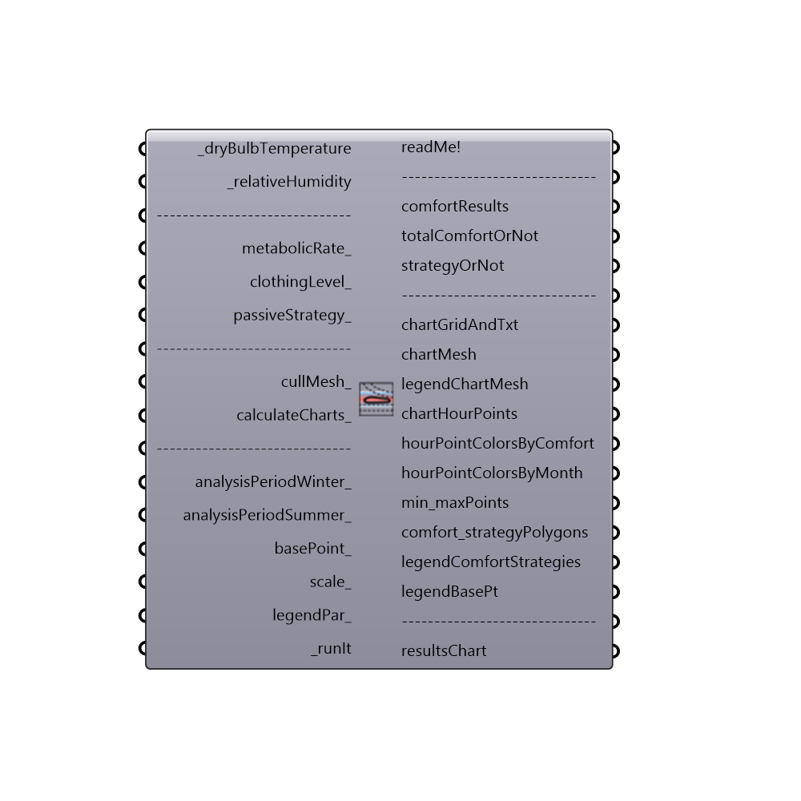

##  Bioclimatic Chart

This is the Bioclimactic Chart. It is based in the originally proposed chart by V. Olgyay and then in the chart presented in the book "Sun, Climate and Architecture" by Brown.
 Use this component to draw a Bioclimatic chart in the Rhino scene and evaluate a set of temperatures and humidity ratios in terms of indoor comfort. Connected data can include either outdoor temperature and humidty ratios from imported EPW weather data, indoor temperature and humidity ratios from an energy simulation, or indivdual numerical inputs of temperature and humidity.  The input data will be plotted alongside polygons on the chart representing comfort as well as polygons representing the efects of passive building strategies on comfort.
 References:
     1. Olgyay, V., 1963. Design with Climate. Bioclimatic Approach to Architectural Regionalism. Van Nostrand reinhold, New York.
     2. Givoni B., 1976. Man, Climate and Architecture. Applied Science Publishers, Ltd., London.
     3. Murray M. and Givoni B., 1979. Architectural Design Based on Climate in Watson D. (ed), 1979. Energy COnservation Through Building Design. McGraw Hill Book Company.
     4. Yezioro, A. & E. Shaviv. 1996. A Knowledge Based CAD System for Determining Thermal Comfort Design Strategies. Renewable Energy, 8: (1-4), (pp. 133-138).
     5. Brown G.Z. and DeKay M., 2001. Sun, WInd & Light. Architectural Design Strategies (2nd edition). John WIley  & Sons, Inc.
 -
 

#### Inputs
* ##### dryBulbTemperature [Required]
A number representing the dry bulb temperature of the air in degrees Celcius. This input can also accept a list of temperatures representing conditions at different times or the direct output of dryBulbTemperature from the Import EPW component.  Indoor temperatures from Honeybee energy simulations are also possible inputs.
* ##### relativeHumidity [Required]
A number between 0 and 100 representing the relative humidity of the air in percentage. This input can also accept a list of relative humidity values representing conditions at different times or the direct output of relativeHumidity from of the Import EPW component.
* ##### metabolicRate [Optional]
A number representing the metabolic rate of the human subject in met. This input can also accept text inputs for different activities. Acceptable text inputs include Sleeping, Reclining, Sitting, Typing, Standing, Driving, Cooking, House Cleaning, Walking, Walking 2mph, Walking 3mph, Walking 4mph, Running 9mph, Lifting 10lbs, Lifting 100lbs, Shoveling, Dancing, and Basketball.  If no value is input here, the component will assume a metabolic rate of 1 met, which is the metabolic rate of a seated human being.
* ##### clothingLevel [Optional]
A number representing the clothing level of the human subject in clo. If no value is input here, the component will assume a clothing level of 1 clo, which is roughly the insulation provided by a 3-piece suit. A person dressed in shorts and a T-shirt has a clothing level of roughly 0.5 clo and a person in a thick winter jacket can have a clothing level as high as 2 to 4 clo.
* ##### passiveStrategy [Optional]
An optional text input of passive strategies to be laid over the Bioclimatic chart as polygons.  Text inputs include "Passive Solar Heating", "Evaporative Cooling", "Thermal Mass + Night Vent" and "Natural Ventilation". NOT WORKING RIGHT NOW!!
* ##### cullMesh [Optional]
Set to "True" to cull the colored mesh to where they have climatic data on them. See chartMesh output. Deafult "False"
* ##### calculateCharts [Optional]
Set to "True" to calculate and show a column type graph showing the percentage of time each strategy is capable of providing comfort conditions. See resultsChart output. Deafult "False"
* ##### analysisPeriodWinter [Optional]
An optional analysis period from the Analysis Period component. If no Analysis period is given and epw data from the ImportEPW component has been connected, the analysis will be run for the enitre year. ONLY WORKS FOR THE WHOLE YEAR RIGHT NOW!!
* ##### analysisPeriodSummer [Optional]
An optional analysis period from the Analysis Period component. If no Analysis period is given and epw data from the ImportEPW component has been connected, the analysis will be run for the enitre year. ONLY WORKS FOR THE WHOLE YEAR RIGHT NOW!!
* ##### basePoint [Optional]
An optional base point that will be used to place the Bioclimatic Chart in the Rhino scene. If no base point is provided, the base point will be the Rhino model origin.
* ##### scale [Optional]
An optional number to change the scale of the Bioclimatic chart in the Rhino scene. By default, this value is set to 1.
* ##### legendPar [Optional]
Optional legend parameters from the Ladybug Legend Parameters component.
* ##### runIt [Required]
Set to "True" to run the component and calculate the adaptive comfort metrics.

#### Outputs
* ##### out
...
* ##### comfortResults
The number of hours and percent of the input data that are inside all comfort and passive strategy polygons.
* ##### totalComfortOrNot
A list of 0's and 1's indicating, for each hour of the input data, if the hour is inside a comfort and/or strategy polygon (1) or not(0).
* ##### strategyOrNot
A list of 0's and 1's indicating, for each hour of the input temperature and humidity ratio, if the hour is inside (1) or not(0), for each passive strategy and comfort polygons.  If there are multiple comfort polyogns or passive strategies connected to the passiveStrategy_ input, this output will be a grafted list for each polygon.
* ##### chartGridAndTxt
The grid and text labels of the Bioclimatic chart.
* ##### chartMesh
A colored mesh showing the number of input hours happen in each part of the Bioclimatic chart.
* ##### legendChartMesh
Script variable BioclimacticChart
* ##### chartHourPoints
Points representing each of the hours of input temperature and humidity ratio.  By default, this ouput is hidden and, to see it, you should connect it to a Grasshopper preview component.
* ##### hourPointColorsByComfort
Color the chartHourPoints above according to Comfort results. They can be hooked up to the "Swatch" input of a Grasshopper Preview component that has the hour points above connected as geometry.  By default, points are colored red if they lie inside comfort or strategy polygons and are colored blue if they do not meet such comfort criteria.
* ##### hourPointColorsByMonth
Colors that the chartHourPoints above according to each month. They can be hooked up to the "Swatch" input of a Grasshopper Preview component that has the hour points above connected as geometry.  By default, points are colored red if they lie inside comfort or strategy polygons and are colored blue if they do not meet such comfort criteria.
* ##### min_maxPoints
Plot each month's Minimal/Maximal values for Temperature and Relative Humidity. By default, this ouput is hidden and, to see it, you should connect it to a Grasshopper preview component.
* ##### comfort_strategyPolygons
A tree of polygons representing the comfort and passive strategies areas of the chart made comfortable.
* ##### legendComfortStrategies
A colored legend showing the number of hours that correspond to each color for the chartMesh output.
* ##### legendBasePt
The legend base point, which can be used to move the legend in relation to the chart with the grasshopper "move" component.
* ##### resultsChart
A column type graph showing the percentage of time each strategy is capable of providing comfort conditions. These results are summarizing the whole year and each month. Each column shows three areas: 
 Comfort Zone (black),
 Passive Solar Heating (yellow), as the only heating strategy for winter time
 Evaporative Cooling or High Termal Mass with Night Ventilation or Natural Ventilation (green, red, blue) as the possible cooling strategies for summer time.

[Check Hydra Example Files for Bioclimatic Chart](https://hydrashare.github.io/hydra/index.html?keywords=Ladybug_Bioclimatic Chart)