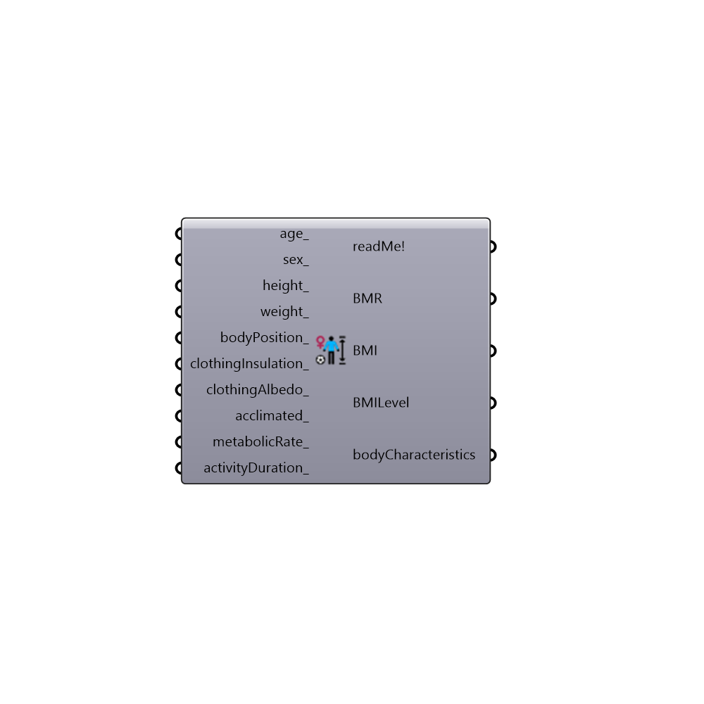

##  Body_Characteristics

Use this component to calculate the Basal Metabolic Rate, Body Mass Index indices and to create the "bodyCharacterstics_" input for the "Thermal comfort indices" component.
 -
 Basal Metabolic Rate formula by Mifflin-St. Jeor. Body Mass Index formula by Adolphe Quetelet.
 -
 Formulas from: "Comparison of predictive equations for resting Metabolic rate in healthy nonobese and obese adults: a systematic review",
 Frankenfield, Roth-Yousey, Compher, American Dietetic Association, 2005.:
 https://www.andeal.org/files/Docs/Frankenfield_et_al_2005%5B1%5D.pdf
 -
 

#### Inputs
* ##### age [Optional]
An age of the person in years.
 -
 If not supplied, default value of 35 will be used.
* ##### gender [Optional]
Person's gender.
 -
 1 or "male"
 2 or "female".
 -
 If not supplied, "male" will be used as a default value.
* ##### height [Optional]
Person's height in centimetres.
 -
 If not supplied default value of 175 cm will be used.
* ##### weight [Optional]
Person's weight in kilograms.
 -
 If not supplied default value of 75 kg will be used.
* ##### bodyPosition [Optional]
Position of person's body.
 -
 1 or "sitting" for sitting position.
 2 or "standing" for standing position.
 3 or "crouching" for crouching position.
 -
 If not supplied, 2 (standing) will be used as a default value.
* ##### clothingInsulation [Optional]
Clothing insulation of a person in "clo" units.
 It ranges from 0 (nude person) to 4 (polar outfit).
 Overall clo value can be determined by adding individual clo values for each type of cloths, based on a clo values table ( http://www.engineeringtoolbox.com/clo-clothing-thermal-insulation-d_732.html )
 A more simplified approch would be:
 -
 0.20 - Very light summer cloths (shorts/skirt, t-shirt, slippers, no socks)
 0.55 - Summer cloths (light trousers, short sleeves or blouse)
 1 - Street-business suit or Typical indoor winter clothing
 1.5 - Suit and cotton coat
 2 - Winter suit and coat
 4 - Heavy polar outfit (fur pants, coat, hood, gloves...)
 -
 If not supplied it will be caclulated for each hour based on air temperature, with minimal 0.6 and maximal 4 clo values.
* ##### acclimated [Optional]
Determine whether the test person had previously experienced heat/cold stress.
 -
 "acclimated" or True if person in subject is acclimatized,
 "unacclimated" or False if it's not.
 -
 If no value is supplied, False (unacclimated) will be used by default.
* ##### metabolicRate [Optional]
Activity's metabolic rate in mets. If not supplied 2.32 will be used as default value
 Here are some of the examples of metabolic rates mets based on activity:
 Activity - met
 -------------------
 Reclining  - 0.8
 Seating - 1.0
 Car driving - 1.2
 Sedentary activity (office, dwelling, school, laboratory) - 1.2
 Standing - 1.2
 Standing (light activity: shopping, laboratory, light industry) - 1.6
 Standing (medium activity: shop assistant, domestic work) - 2.0
 Walking (4 km/h) - 2.32
 Walking (5 km/h) - 3.4
 ...
 Washing dishes standing - 2.5
 Domestic work (raking leaves on the lawn) - 2.9
 Domestic work (washing by hand and ironing) - 2.9
 Iron and steel (ramming the mould with a pneumatic hammer) - 3.0
 Building industry (brick laying) - 2.2
 Building industry (forming the mould) - 3.1
 Building industry (loading a wheelbarrow with stones and mortar) - 4.7
 Forestry (cutting with chainsaw) - 3.5
 Forestry (working with an axe) - 8.5
 Agriculture (digging with a spade) - 6.5
 ...
 Volleyball - 4.0
 Golf - 5.0
 Softball - 5.0
 Gymnastics - 5.5
 Aerobic Dancing - 6.0
 Swimming - 6.0
 Ice skating - 6.2
 Bicycling (15 km/h) - 4.0
 Bicycling (20km/h) - 6.2
 Skiing (9 km/h) - 7.0
 Backpacking - 7.0
 Basketball - 7.0
 Handball - 8.0
 Hockey - 8.0
 Racquetball - 8.0
 Soccer - 8.0
 Running (8 km/h) - 8.5
 Running (15km/h) - 9.5
 -
 If not supplied default value of 2.32 (walking 4 km/h or 1.1m/s) mets will be used.
* ##### activityDuration [Optional]
Duration of the activity sequence in minutes.
 -
 If not supplied, default value of 480 minutes (8 hours) will be used.

#### Outputs
* ##### readMe!
...
* ##### BMR
Basal Metabolic Rate - represents the minimum daily amount of energy needed to keep your body functioning, including breathing and keeping your heart beating, without lossing weight. It does not include the the calories you burn from normal daily activities or exercise.
 To account for daily activities and exercises, this BMR value needs to be multiplied with:
 -
 1.2 - Light or no exercise and desk job
 1.375 - Light exercise or sports 1-3 days a week
 1.55 - Moderate exercise or sports 3-5 days a week
 1.725 - Hard exercise or sports 6-7 days a week
 1.9 - Hard daily exercise or sports and physical job
 -
 Once the person knows the number of daily calories needed to maintain its weight, it can easily calculate the number of calories it needs to eat in order to gain or lose weight.
 In calories/day.
* ##### BMI
Body Mass Index - is the ratio of the persons weight to square of height. It is generally used as a method of screening for weight category.
 In kg/m2.
* ##### BMILevel
Level of BMI for adult (18 years and older) males and females:
 ----------------
 - for males:
 BMI < 17.5 - Anorexia
 17.5 < BMI < 20.7 - Underweight
 20.7 < BMI < 26.4 - Normal weight
 26.4 < BMI < 27.8 - Marginally overweight
 27.8 < BMI < 31.1 - Overweight
 31.1 < BMI < 40 - Obese
 BMI > 40 - Extreme obesity
 -
 - for females:
 BMI < 17.5 - Anorexia
 17.5 < BMI < 19.1 - Underweight
 19.1 < BMI < 25.8 - Normal weight
 25.8 < BMI < 27.3 - Marginally overweight
 27.3 < BMI < 32.3 - Overweight
 32.3< BMI < 40 - Obese
 BMI > 40 - Extreme obesity
 -
 In calories/day.
* ##### bodyCharacteristics
A list of inputted values (age, gender, height, weight, bodyPosition, clothingInsulation, acclimated, metabolicRate, activityDuration).
 -
 Use it for the "Thermal comfort indices" component's "bodyCharacteristics_" input.

[Check Hydra Example Files for Body Characteristics](https://hydrashare.github.io/hydra/index.html?keywords=Ladybug_Body Characteristics)