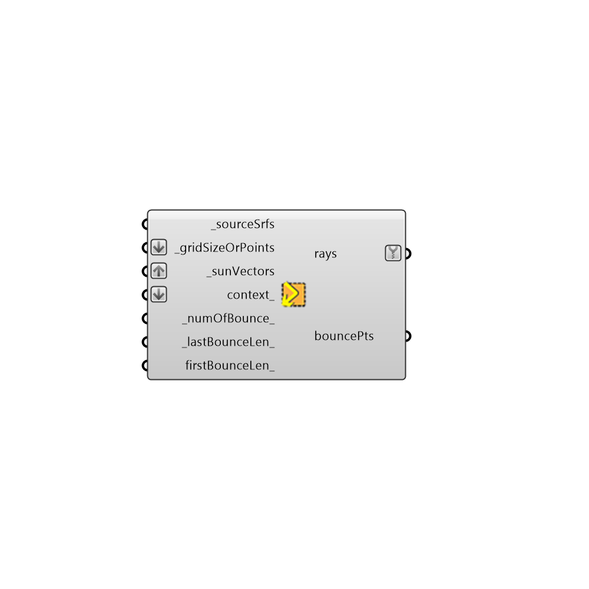

## Bounce from Surface []

Use this component to get a sense of how direct sunlight is reflected off of an initial _sourceSrf and subsequently to a set of context_ geometries by tracing sun rays forwards through this geometry.
 Examples where this component might be useful include the evaluation of the diffusion of light by a light shelf, or testing to see whether a parabolic building geometry (like a Ghery building) might focus sunlight to dangerous levels at certain times of the year.
 Note that this component assumes that all sun light is reflected off of these geometries specularly (as if they were a mirror) and, for more detailed raytrace analysis, the Honeybee daylight components should be used.
 -
 

#### Inputs
* ##### _sourceSrfs [Required]
A brep or mesh representing a surface that you are interested in seeing direct sunlight bounce off of.  You can also put in lists of breps or meshes. These surfaces will be used to generate the initial sun rays in a grid-like pattern.  Note that, for curved surfaces, smooth meshes of the geometry will be more accurate than inputing a Brep.
* ##### _gridSizeOrPoints [Required]
A number in Rhino model units that represents the average size of a grid cell to generate the points, or list of points itself.  Note that, if you put in meshes for the input above, the _gridSize number option of this input will not work as this component will use the vertices of the mesh to generate the sun rays.
* ##### _sunVectors [Required]
A sun vector from the sunPath component or a list of sun vectors to be forward ray-traced.
* ##### context_ [Optional]
Breps or meshes of conext geometry, which will reflect the sun rays after they bounce off of the _sourceSrfs.  Note that, for curved surfaces, smooth meshes of the geometry will be more accurate than inputing a Brep.
* ##### _numOfBounce_ [Default]
An interger representing the number of ray bounces to trace the sun rays forward.
* ##### _lastBounceLen_ [Default]
A number representing the length of the sun ray after the last bounce. If left empty, this length will be the diagonal of the bounding box surrounding all input geometries.
* ##### firstBounceLen_ [Optional]
A number representing the length of the sun ray before the first bounce. If left empty, this length will be the diagonal of the bounding box surrounding all input geometries.

#### Outputs
* ##### rays
The sun rays traced forward through the geometry.
* ##### bouncePts
The generated base points on the _sourceSrfs to which the sun rays will be directed. The preview of this output is set to be hidden by default.  Connect to a Grasshopper "Point" component to visualize.

[Check Hydra Example Files for Bounce from Surface](https://hydrashare.github.io/hydra/index.html?keywords=Ladybug_Bounce from Surface)