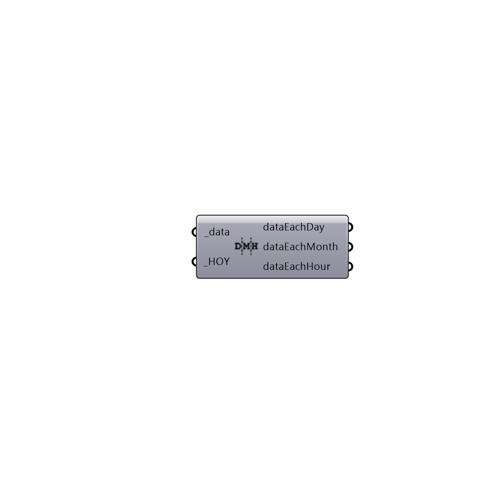

##  Branch_Data

Use this component to branch any data based on day, month and hour. Number of data items should match number of HOYs.
 -
 

#### Inputs
* ##### data [Required]
A list of data to be branched for each month
* ##### HOY [Required]
A list of numbers between 1 and 8760 that represents an hour of the year.

#### Outputs
* ##### dataEachDay
Branched data for each day of the month. Branches are from 0 to 30.
* ##### dataEachMonth
Branched data for each month of the year. Branches are from 0 to 11.
* ##### dataEachHour
Branched data for each hour of the day. Branches are from 0 to 23.

[Check Hydra Example Files for Branch Data](https://hydrashare.github.io/hydra/index.html?keywords=Ladybug_Branch Data)