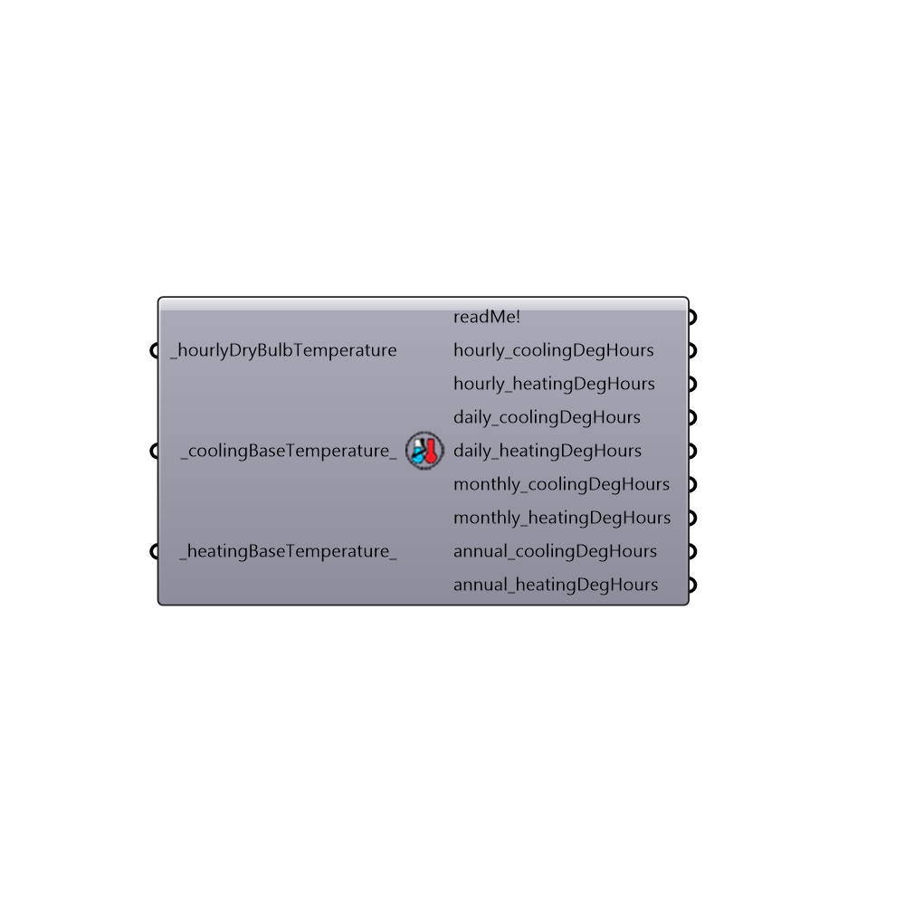

##  CDH_HDH - [[source code]](https://github.com/ladybug-tools/ladybug-legacy/tree/master/src/Ladybug_CDH_HDH.py)

Calculates heating and cooling degree-hours.
 Degree-hours are defined as the difference between the base temperature and the average ambient outside air temperature multiplied by the number of hours that this difference condition exists.
 -
 

#### Inputs
* ##### hourlyDryBulbTemperature [Required]
Annual dry bulb temperature from the Import epw component (in degrees Celsius).
* ##### coolingBaseTemperature [Default]
Base temperature for cooling (in degrees Celsius). Default is set to 23.3C but this can be much lower if the analysis is for a building with high heat gain or insulation.
* ##### heatingBaseTemperature [Default]
Base temperature for heating (in degrees Celsius). Default is set to 18.3C but this can be much lower if the analysis is for a building with high heat gain or insulation.

#### Outputs
* ##### readMe!
A ummary of the input.
* ##### hourly_coolingDegHours
Cooling degree-hours for each hour of the year. For visualizations over the whole year, connect this to the grasshopper chart/graph component. 
* ##### hourly_heatingDegHours
Heating degree-days for each hour of the year. For visualizations over the whole year, connect this to the grasshopper chart/graph component. 
* ##### daily_coolingDegHours
Cooling degree-days summed for each day of the year. For visualizations of over the whole year, connect this to the grasshopper chart/graph component. 
* ##### daily_heatingDegHours
Heating degree-days summed for each day of the year. For visualizations of over the whole year, connect this to the grasshopper chart/graph component. 
* ##### monthly_coolingDegHours
Cooling degree-days summed for each month of the year.
* ##### monthly_heatingDegHours
Heating degree-days summed for each month of the year.
* ##### annual_coolingDegHours
The total cooling degree-days for the entire year.
* ##### annual_heatingDegHours
The total heating degree-days for the entire year.

[Check Hydra Example Files for CDH_HDH](https://hydrashare.github.io/hydra/index.html?keywords=Ladybug_CDH_HDH)