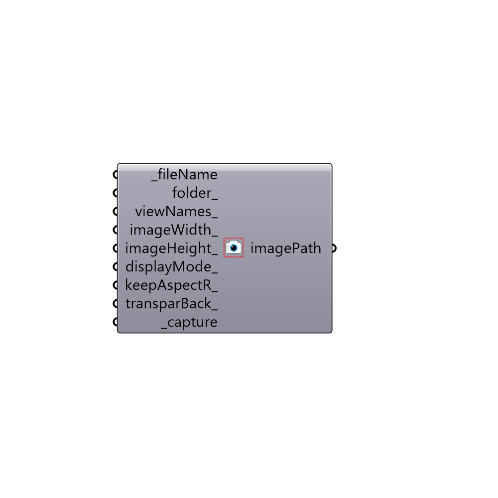

##  Capture View

Use this component to capture Rhino views and save them to your hard drive as as a .png files.
 This is particularly useful if you are trying to create animations of Grasshopper geometry and want to automate the capturing of views.
 Note that your images will have a Rhino world axes icon in the lower left of the image unless you go to Options > Grid > and uncheck "Show world axes icon" in Rhino.
 -
 

#### Inputs
* ##### fileName [Required]
The file name that you would like the image to be saved as.  Note that, for animations, you want to make sure that each saved images has a different filename otherwise the previous image will be overwritten by each successive image.
* ##### folder [Optional]
The folder into which you would like to write the image file.  This should be a complete file path to the folder.  If no folder is provided, the images will be written to C:/Ladybug/Capturedviews/.
* ##### viewNames [Optional]
The Rhino viewport name which you would like to take a snapshot of.  Acceptable inputs include "Perspective", "Top", "Bottom", "Left", "Right", "Front", "Back" or any view name that you have already saved within the Rhino file (note that you do not need to input quotations).  If no text is input here, the default will be an image of the active viewport (or the last viewport in which you navigated).
* ##### imageWidth [Optional]
The width of the image that you would like to take in pixels.  If no value is provided here, the component will set the width to that of the active Rhino viewport on your screen.
* ##### imageHeight [Optional]
The height of the image that you would like to take in pixels.  If no value is provided here, the component will set the height to that of the active Rhino viewport on your screen.
* ##### displayMode [Optional]
The display mode of the viewport that you would like to take an image of. Acceptable inputs include "Wireframe", "Shaded", "Rendered", "Ghosted", "X-Ray", "Technical", "Atristic", and "Pen".  If no text is input here, the default will be the displaymode of the active viewport (or the last viewport in which you navigated).
* ##### keepAspectR [Optional]
Set to "True" to keep the aspect ratio of the viewport in the images that you save.  By default, this is set to "False" if you have connected an imageHeight_ but will override this input to ensure correct aspect ratio if set to "True".
* ##### transparBack [Optional]
Set to "True" to have a transparent background for the image and set to "False" to save a picture using the Rhino viewport background color.  The default is set to "True" for a transparent background.
* ##### capture [Required]
Set to "True" to capture the image of the Rhino viewport and save it to your hard drive.

#### Outputs
* ##### imagePath
The filepath of the image taken with this component.

[Check Hydra Example Files for Capture View](https://hydrashare.github.io/hydra/index.html?keywords=Ladybug_Capture View)