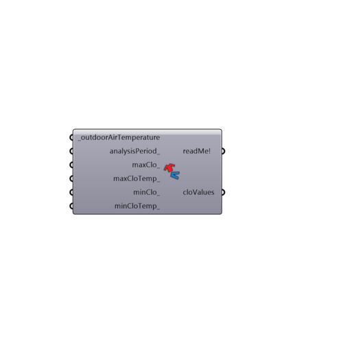

##  Clothing Function

Use this component to generate a list of values representing a clothing schedule based on outdoor air temperature.  This schedule can be plugged into the clothingLevel_ input of the PMV Comfort Calculator component.
 By default, this function used to derive clothing levels based on outside temperature was developed by Schiavon, Stefano and implemented on the CBE comfort tool (http://smap.cbe.berkeley.edu/comforttool/).
 This version of the component allows users to change the maximum and minimum clothing levels, which Schiavon set at 1 and 0.46 respectively, and the temperatures at which these clothing levels occur, which Schiavon set at 26C and -5 C respectively.
 Note that Schiavon did not endorse the changing of these values but they are provided here to allow users an additional level of freedom.
 -
 

#### Inputs
* ##### outdoorAirTemperature [Required]
A number or list of numbers representing the dry bulb temperature of the air in degrees Celcius.  This input can also accept the direct output of dryBulbTemperature from the Import EPW component and this is recommended for hourly comfort analysis.
* ##### analysisPeriod [Optional]
If you have hooked up annual temperatures from the importEPW component, use this input to 
* ##### maxClo [Optional]
An optional number representing the maximum clo value that someone will wear on the coldest days of the outdoorAirTemperature input.  The default is set to 1 clo, which corresponds to a 3-piece suit.
* ##### maxCloTemp [Optional]
An optional number representing the temperature at which the maxClo_ value will be applied.  The default is set to -5C, which means that any lower temperature will get the maxClo_ value.
* ##### minClo [Optional]
An optional number representing the minimum clo value that someone will wear on the hotest days of the outdoorAirTemperature input.  The default is set to 0.46 clo, which corresponds to shorts and a T-shirt.
* ##### minCloTemp [Optional]
An optional number representing the temperature at which the minClo_ value will be applied.  The default is set to 26C, which means that any higher temperature will get the minClo_ value.

#### Outputs
* ##### readMe!
...
* ##### cloValues
A list of numbers representing the clothing that would be worn at each hour of the _outdoorAirTemperature.  Note that, if the component senses that you have hooked up a stream of hourly data, the clothing levels will alternate on a 12-hour basis.

[Check Hydra Example Files for Clothing Function](https://hydrashare.github.io/hydra/index.html?keywords=Ladybug_Clothing Function)