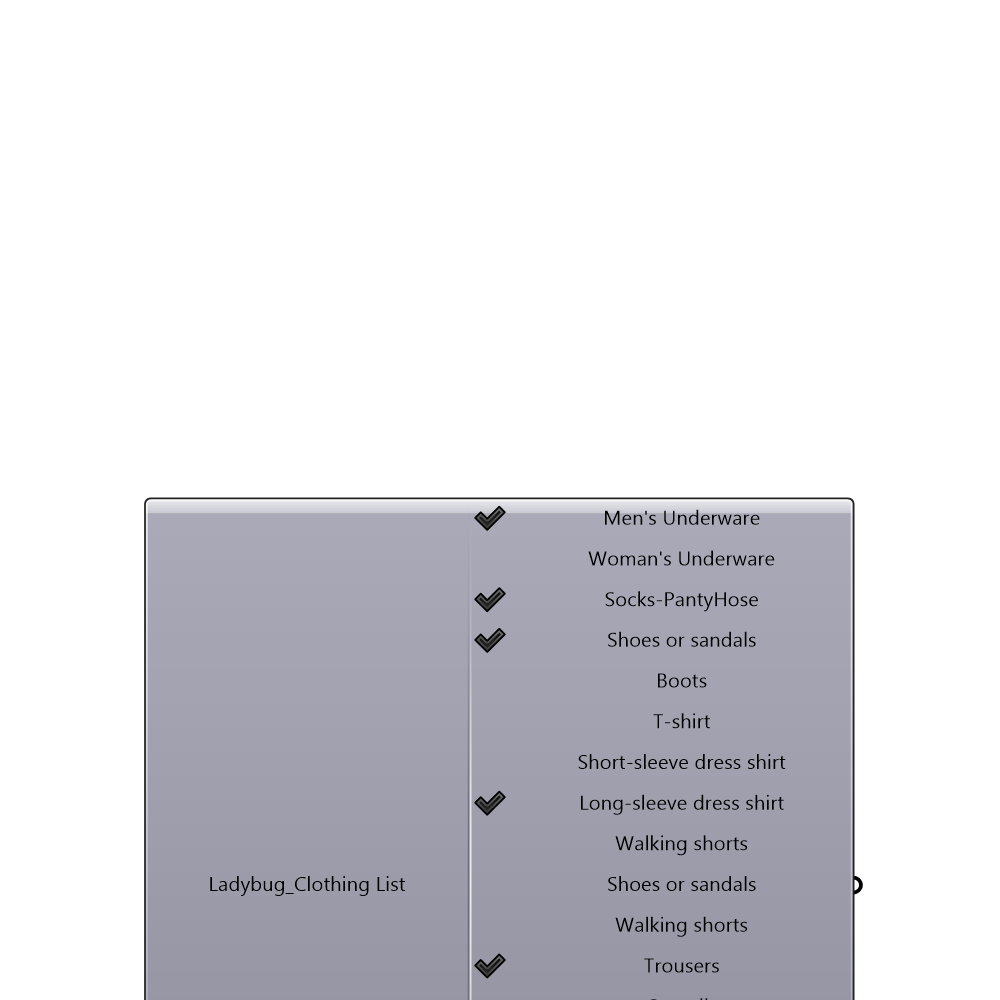

##  Clothing List - [[source code]](https://github.com/ladybug-tools/ladybug-legacy/tree/master/src/Ladybug_Clothing%20List.py)

Provides a list of various clothes and values

#### Inputs

[Check Hydra Example Files for Clothing List](https://hydrashare.github.io/hydra/index.html?keywords=Ladybug_Clothing List)