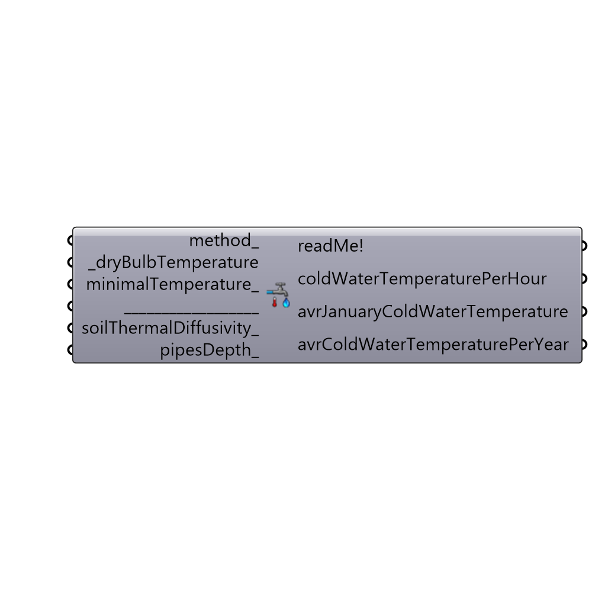

##  Cold Water Temperature - [[source code]](https://github.com/mostaphaRoudsari/ladybug/tree/master/src/Ladybug_Cold%20Water%20Temperature.py)

Use this component to calculate the cold (inlet, mains) water temperature, if water pipes are burried undeground.
 Sources:
 http://www.energy.ca.gov/2013publications/CEC-400-2013-003/CEC-400-2013-003-CMF-REV.pdf
 http://www.nrel.gov/docs/fy04osti/35917.pdf
 http://www.solarthermalworld.org/sites/gstec/files/story/2015-05-31/textbook_swh.pdf
 -
 

#### Inputs
* ##### method [Optional]
A method by which the cold water temperature will be calculated:
 -
 0 - Carslaw and Jaeger (used by DOE-2)
 1 - Christensen and Burch (used by EnergyPlus)
 2 - used by RETScreen
 -
 If not supplied, method "1" (Christensen and Burch) will be used by default.
* ##### dryBulbTemperature [Required]
Hourly Dry Bulb Temperature (air temperature).
 Import it from Ladybug "Import EPW" component.
 -
 In °C.
* ##### minimalTemperature [Optional]
The minimum cold temperature value.
 For example this input can be used to prevent the water in your pipes from freezing, by limiting it to 1°C (33.8F).
 -
 If not supplied, default value 1 (°C) will be used.
 -
 In °C.
* ##### soilThermalDiffusivity [Optional]
The ability of a soil to conduct thermal energy relative to its ability to store thermal energy.
 -
 This input is only important for method "0" !!!
 Soil type for method "1" is unknown, and can not be changed. The "1" formula is derived from various field and soil data accross USA.
 Soil type for method "2" is fixed to: wet clay soil, and can not be changed.
 -
 Soil thermal diffusivity for particular types of soil (m2/s * 10^(-7)):
 2.4 - dry sand
 7.4 - wet sand
 2.5 - dry clay
 5.1 - wet clay
 1.0 - dry peat
 1.2 - wet peat
 12.9 - dense rock
 -
 If not supplied, default value 2.5 (dry clay) will be used.
 -
 In m2/s * 10^(-7).
* ##### pipesDepth [Optional]
The soil depth at which cold water pipes are burried at.
 -
 This input is only important for method "0" !!!
 Pipes depth range for method "1" is fixed from 0.3 to 1 meters (1 to 3.5 feet), and can not be changed.
 Pipes depth for method "2" is fixed to 2 meters, and can not be changed.
 -
 If not supplied, default value of 1(m) will be used.
 -
 In meters.

#### Outputs
* ##### readMe!
...
* ##### coldWaterTemperaturePerHour
Cold water temperature for picked pipesDepth_ and soilThermalDiffusivity_, for each hour during a year.
 -
 In °C.
* ##### avrJanuaryColdWaterTemperature
Average January cold water temperature for picked pipesDepth_ and soilThermalDiffusivity_.
 Use it for "SWHsystem" component's "avrJanuaryColdWaterTemperature_" input.
 -
 In °C.
* ##### avrColdWaterTemperaturePerYear
Average annual cold water temperature for picked pipesDepth_ and soilThermalDiffusivity_.
 -
 In °C.

[Check Hydra Example Files for Cold Water Temperature](https://hydrashare.github.io/hydra/index.html?keywords=Ladybug_Cold Water Temperature)