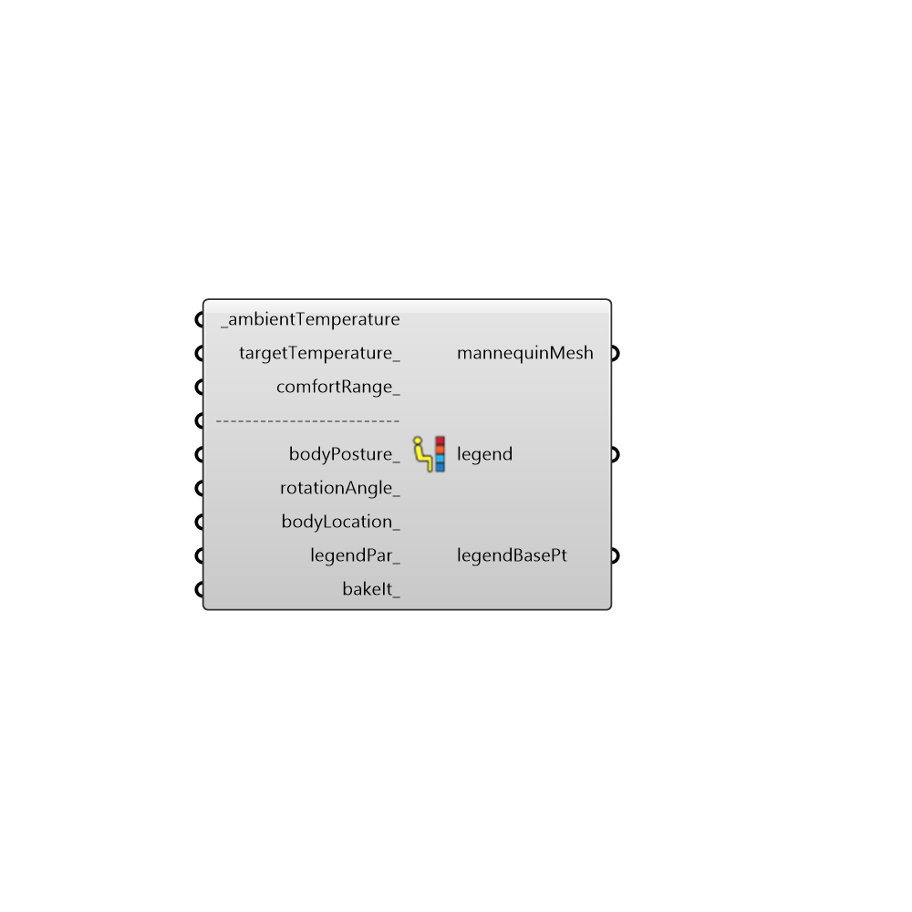

##  Comfort Mannequin - [[source code]](https://github.com/ladybug-tools/ladybug-legacy/tree/master/src/Ladybug_Comfort%20Mannequin.py)

Use this component to color a mannequin based on their relation to a comfort temperature.
 -
 

#### Inputs
* ##### ambientTemperature [Required]
The temperture around the mannequin, which can be either UTCI (outdoor comfort), Standard Effective Temperature (PMV comfort), or Operative Temperature (Adaptive Comfort).
* ##### targetTemperature [Optional]
The target comfort temperature that the mannequin wants to be at.  The default is set to 20C
* ##### comfortRange [Optional]
The number of degrees above and below the target temperture that the subject will still find comfortable.  The default is set to 3C, which is pretty common for many comfort metrics.
* ##### bodyPosture [Optional]
An interger to set the posture of the comfort mannequin, which can have a large effect on the radiation striking the mannequin.  0 = Standing, 1 = Sitting, and 2 = Lying Down.  The default is set to 1 for sitting.
* ##### rotationAngle [Optional]
An optional rotation angle in degrees.  Use this number to adjust the angle of the comfort mannequin in space.  The angle of the mannequin in relation to the sun can have a large effect on the amount of radiation that falls on it and thus largely affect the resulting mean radiant temperature.
* ##### bodyLocation [Optional]
An optional point that sets the position of the comfort mannequin in space.  Use this to move the comfort mannequin around in relation to contextShading_ connected below. The default is set to the Rhino origin.
* ##### legendPar [Optional]
Optional legend parameters from the Ladybug Legend Parameters component.
* ##### bakeIt [Optional]
An integer that tells the component if/how to bake the bojects in the Rhino scene.  The default is set to 0.  Choose from the following options:
 0 (or False) - No geometry will be baked into the Rhino scene (this is the default).
 1 (or True) - The geometry will be baked into the Rhino scene as a colored hatch and Rhino text objects, which facilitates easy export to PDF or vector-editing programs.
 2 - The geometry will be baked into the Rhino scene as colored meshes, which is useful for recording the results of paramteric runs as light Rhino geometry.

#### Outputs
* ##### mannequinMesh
A colored mesh of a comfort mannequin showing the amount of radiation falling over the mannequin's body.
* ##### legend
A legend that corresponds to the colors on the mannequinMesh and shows the relative W/m2.
* ##### legendBasePt
The legend base point, which can be used to move the legend in relation to the chart with the grasshopper "move" component.

[Check Hydra Example Files for Comfort Mannequin](https://hydrashare.github.io/hydra/index.html?keywords=Ladybug_Comfort Mannequin)