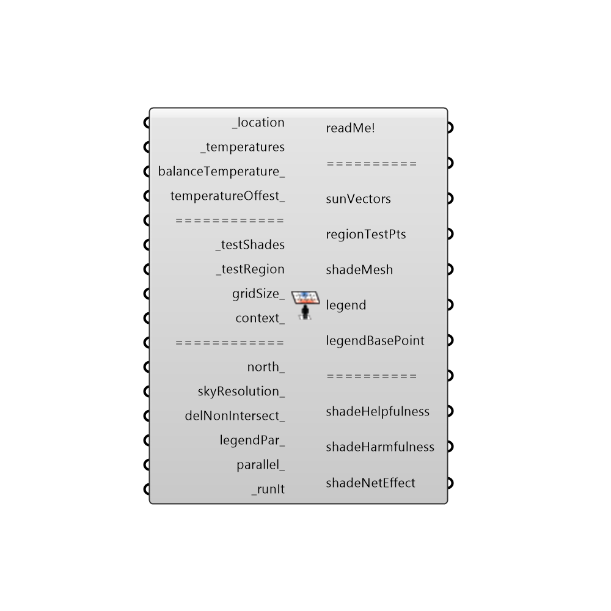

##  Comfort Shade Benefit Evaluator - [[source code]](https://github.com/ladybug-tools/ladybug-legacy/tree/master/src/Ladybug_Comfort%20Shade%20Benefit%20Evaluator.py)

This is a component for visualizing the desirability of shade in terms of thermal comfort by using solar vectors, a series of hourly temperatures (usually outdoor temperatures), and an assumed "balance" temperature (or comfort temperature).  The balance temperature represents the median temperture that people find comfortable, which is usually around 17.5C in outdoor conditions.
 _
 Solar vectors for hours when the temperature is above the balance point contribute positively to shade desirability while solar vectors for hours when the temperature is below the balance point contribute negatively.
 _
 The component outputs a colored mesh of the shade illustrating the net effect of shading each mesh face.  A higher saturation of blue indicates that shading the cell is very desirable.  A higher saturation of red indicates that shading the cell is harmful (blocking more helpful winter sun than harmful summer sun). Desaturated cells indicate that shading the cell will have relatively little effect on thermal comfort.
 _
 The units for shade desirability are degree-days, which are essentially the amount of time in days that sun is blocked by a given cell multiplied by the degrees above (or below) the _balanceTemperature during that time.  So, if a given square meter of _testShade has a shade desirability of 10 degree-days, this means that a shade in this location provides roughly 1 day of sun protection from conditions 10 degrees celcius warmer than the balanceTemperature_ to 1 square meter of _testRegion.
 _
 More information on the methods sued by this component can be found in the following publication:
 Mackey, Christopher; Sadeghipour Roudsari, Mostapha; Samaras, Panagiotis. “ComfortCover: A Novel Method for the Design of Outdoor Shades.” In Proceedings of Symposium on Simulation for Archoitecture and Urban Design. Washington, DC, United States, Apr 12-15 2015.
 https://drive.google.com/file/d/0Bz2PwDvkjovJQVRTRHhMSXZWZjQ/view?usp=sharing
 -
 

#### Inputs
* ##### location [Required]
The location output from the importEPW or constructLocation component.  This is essentially a list of text summarizing a location on the earth.
* ##### temperatures [Required]
A stream of 8760 temperature values (including a header) representing the temperature at each hour of the year that will be used to evaluate shade benefit.  This can be the dryBulbTemperature from the 'Import EPW' component, the univeralThermalClimateIndex (UTCI) output from the 'Outdoor Comfort Calculator' component, or the standardEffectiveTemperature (SET) output from the 'PMV Comfort Calculator' component.  If you are using this component to evaluate shade for a passive building with no heating/cooling, this input can also be the indoor temperature of the zone to be shaded.
* ##### balanceTemperature [Optional]
An estimated balance temperature representing median temperture that people find comfortable, which can vary from climate to climate. The default is set to 17.5C, which is the median outdoor comfort temperature (UTCI) that defines the conditions of no thermal stress (9 < UTCI <26).
* ##### temperatureOffest [Optional]
An number represeting the offset from the balanceTemperature_ in degrees Celcius at which point the shade importance begins to have an effect.  The default is set to 8.5 C, which is the range of outdoor comfort temperature (UTCI) that defines the conditions of no thermal stress (9 < UTCI <26).
* ##### testShades [Required]
A Brep representing the shade to be evaluated for its benefit.
* ##### testRegion [Required]
A brep representing an outdoor area for which shading is being considered or the window of a building that would be affected by the shade. Note that only breps with a single surface are supported now and volumetric breps will be included at a later point.
* ##### gridSize [Optional]
The length of each of the shade's test cells in model units.  Please note that, as this value gets lower, simulation times will increase exponentially even though this will give a higher resolution of shade benefit.
* ##### context [Optional]
Script variable ShadeBenefit
* ##### north [Optional]
Input a vector to be used as a true North direction for the sun path or a number between 0 and 360 that represents the degrees off from the y-axis to make North.  The default North direction is set to the Y-axis (0 degrees).
* ##### skyResolution [Optional]
An interger equal to 0 or above to set the number of times that the tergenza sky patches are split.  A higher number will ensure a greater accuracy but will take longer.  At a sky resolution of 4, each hour's temperature is essentially matched with an individual sun vector for that hour.  At a resolution of 5, a sun vector is produced for every half-hour, at 6, every quarter hour, and so on. The default is set to 4, which should be high enough of a resolution to produce a meaningful reault in all cases.
* ##### delNonIntersect [Optional]
Set to "True" to delete mesh cells with no intersection with sun vectors.  Mesh cells where shading will have little effect because an equal amount of warm and cool temperature vectors will still be left in white.
* ##### legendPar [Optional]
Legend parameters that can be used to re-color the shade, change the high and low boundary, or sync multiple evaluated shades with the same colors and legend parameters.
* ##### parallel [Optional]
Set to "True" to run the simulation with multiple cores.  This can increase the speed of the calculation substantially and is recommended if you are not running other big or important processes.
* ##### bakeIt [Optional]
An integer that tells the component if/how to bake the bojects in the Rhino scene.  The default is set to 0.  Choose from the following options:
 0 (or False) - No geometry will be baked into the Rhino scene (this is the default).
 1 (or True) - The geometry will be baked into the Rhino scene as a colored hatch and Rhino text objects, which facilitates easy export to PDF or vector-editing programs.
 2 - The geometry will be baked into the Rhino scene as colored meshes, which is useful for recording the results of paramteric runs as light Rhino geometry.
* ##### runIt [Required]
Set to 'True' to run the simulation.

#### Outputs
* ##### readMe!
...
* ##### sunVectors
The sun vectors that were used to evaluate the shade (note that these will increase as the sky desnity increases).
* ##### regionTestPts
Points across the test region surface from which sun vectors will be projected
* ##### shadeMesh
A colored mesh of the _testShades showing where shading is helpful (in satuated blue), harmful (in saturated red), or does not make much of a difference (white or desaturated colors).
* ##### legend
Legend showing the numeric values of degree-days that correspond to the colors in the shade mesh.
* ##### legendBasePoint
Script variable Shade Benefit
* ##### shadeHelpfulness
The cumulative degree-days helped by shading the given cell. If a given square meter of _testShade has a shade helpfulness of 10 degree-days, this means that a shade in this location provides roughly 1 day of sun protection from conditions 10 degrees celcius warmer than the balanceTemperature_ to 1 square meter of _testRegion.
* ##### shadeHarmfulness
The cumulative degree-days harmed by shading the given cell.  If a given square meter of _testShade has a shade harmfulness of -10 degree-days, this means that a shade in this location blocks roughly 1 day of sun duirng conditions that are 10 degrees celcius colder than the balanceTemperature_ to 1 square meter of _testRegion.
* ##### shadeNetEffect
The sum of the helpfulness and harmfulness for each cell.  This will be negative if shading the cell has a net harmful effect and positive if the shade has a net helpful effect.

[Check Hydra Example Files for Comfort Shade Benefit Evaluator](https://hydrashare.github.io/hydra/index.html?keywords=Ladybug_Comfort Shade Benefit Evaluator)