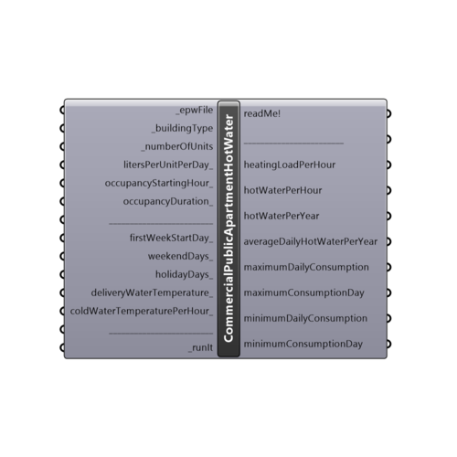

##  Commercial Public Apartment Hot Water

Use this component to calculate domestic hot water consumption for each hour during a year, for Commercial, Public and Apartment buildings.
 The following types of buildings are supported:
 -
 - office
 - apartment house or multifamily building
 - hotel/motel
 - restaurants, cafeterias
 - drive-ins, grilles, luncheonettes, sandwich, snack shops
 - primary school
 - junior and senior high school
 - men's dormitory
 - women's dormitory
 - hospital
 - nursing home
 - factory
 -
 Component based on paper: ASHRAE 2003 Applications Handbook (SI), Chapter 49, Service water heating:
 https://cours.etsmtl.ca/mec735/Documents/Notes_de_cours/2012/Hiver_2012/Service_Water_heating_ASHRAE.pdf
 -
 

#### Inputs
* ##### epwFile [Required]
Input .epw file path by using grasshopper's "File Path" component.
* ##### buildingType [Required]
Choose the building type for which hot water consumption will be calculated:
 -
 0 - office
 1 - apartment house, with 20 or less apartments
 2 - apartment house, from 21 to 49 apartments
 3 - apartment house, from 50 to 74 apartments
 4 - apartment house, from 75 to 99 apartments
 5 - apartment house, from 100 to 199 apartments
 6 - apartment house, more than 200 apartments
 7 - hotel/motel with 20 or less rooms
 8 - hotel/motel from 21 to 60 rooms
 9 - hotel/motel from 61 to 99 rooms
 10 - hotel/motel more than 100 rooms
 11 - (full meal) restaurants, cafeterias
 12 - drive-ins, grilles, luncheonettes, sandwich, snack shops
 13 - primary school
 14 - junior and senior high school
 15 - men's dormitory
 16 - women's dormitory
 17 - hospital
 18 - nursing home
 19 - factory
* ##### numberOfUnits [Required]
Number of units for upper chosen "_buildingType". Represents the number of:
 -
 - apartment units:  apartment houses
 - occupants:  offices, elementary, junior, senior high schools, dormitories , hospitals, factories
 - meals per day:  (full meal) restaurants, cafeterias; drive-ins, grilles, luncheonettes, sandwich, snack shops
 - beds:  nursing homes
* ##### litersPerUnitPerDay [Optional]
Number of liters for a single unit and day, based on _buidlingType
 -
 office -  3.8 l/day/occupant
 apartment house, with 20 or less apartments -  170 l/day/apartment
 apartment house, from 21 to 49 apartments -  159.2 l/day/apartment
 apartment house, from 50 to 74 apartments -  151.6 l/day/apartment
 apartment house, from 75 to 99 apartments -  144 l/day/apartment
 apartment house, from 100 to 199 apartments -  140.2 l/day/apartment
 apartment house, more than 200 apartments -  132.7 l/day/apartment
 hotel/motel with 20 or less rooms -  98 l/day/room
 hotel/motel from 21 to 59 rooms -  75.8 l/day/room
 hotel/motel from 60 to 99 rooms -  53.1 l/day/room
 hotel/motel more than 100 rooms -  37.9 l/day/room
 (full meal) restaurants, cafeterias -  9.1 l/day/meal
 drive-in, grille, luncheonette, sandwich, snack shop - 2.6 l/day/meal
 primary school -  2.3 l/day/pupil
 junior and senior high school -  6.8 l/day/pupil
 men's dormitory -  49.7 l/day/student
 women's dormitory -  46.6 l/day/student
 hospital -  160 l/day/patient
 nursing home -  69.7 l/day/bed
 factory -  45 l/day/worker
 -
 If not supplied, it will be picked based on chosen "_buildingType" and "_numberOfUnits" inputs.
* ##### occupancyStartingHour [Optional]
An hour (from 1 to 24) during a day at which the occupancy of the chosen _buildingType starts:
 -
 office -  9
 apartment house 7
 hotel/motel 7
 (full meal) restaurant, cafeteria -  7
 drive-in, grill, luncheonette, sandwich, snack shop - 7
 primary school -  9
 junior and senior high school -  9
 men's dormitory -  8
 women's dormitory -  8
 hospital -  1
 nursing home -  1
 factory -  1
 -
 If not supplied, it will be picked based on chosen "_buildingType" input.
* ##### occupancyDuration [Optional]
Number of adults (14 years and older) in household.
 -
 office -  9
 apartment house -  15
 hotel/motel -  8
 (full meal) restaurant, cafeteria -  12
 drive-in, grill, luncheonette, sandwich, snack shop - 17
 primary school -  7
 junior and senior high school -  7
 men's dormitory -  15
 women's dormitory -  15
 hospital -  24
 nursing home -  24
 factory -  24
 -
 If not supplied, it will be picked based on chosen "_buildingType" input.
* ##### firstWeekStartDay [Optional]
Week day on which a year starts (1 - Monday, 2 - Tuesday, 3 - Wednesday...)
 -
 If not supplied, default value: 1 will be used (year starts on Monday, 1st January).
* ##### weekendDays [Optional]
Define a list of two weekend (nonworking) days. Through out the World, countries have different days as their weekend days:
 -
 Thursday and Friday (4,5)
 Friday and Saturday (5,6)
 Saturday and Sunday (6,7)
 -
 If not supplied, Saturday and Sunday (6,7) will be taken as a default weekend days.
* ##### holidayDays [Optional]
List of days (1 to 365) which are holiday (nonworking) days.
 -
 If not supplied, no holiday days will be used, with exception of "school" (_buildingType: 13 and 14) where summer, winter and spring/autumn holidays will be applied.
 For northern hemisphere, USA school holidays schedules have been taken as a default.
 For southern hemisphere, Australian school holidays schedule have been taken as a default.
* ##### deliveryWaterTemperature [Optional]
Required water temperature. In Celsius
 It is recommended for delivery water temperature to not be lower than 60°C (140°F) to avoid the risk of Legionella pneumophila bacteria appearance.
 -
 If not supplied, default value: 60°C (140°F) will be used.
 -
 In Celsius degrees.
* ##### coldWaterTemperaturePerHour [Optional]
Cold (inlet) water temperature supplied from public water system, for each hour during a year. In Celsius.
 To calculate it, use the "coldWaterTemperaturePerHour" output of the Ladybug "Cold Water Temperature" component.
 -
 If not supplied, it will be calculated based on Christensen and Burch method (method 1 from "Cold Water Temperature" component), with pipes depth from 0.3 to 1 meters, and unknown soil type.
 -
 In Celsius degrees.
* ##### runIt [Required]
...

#### Outputs
* ##### readMe!
...
* ##### heatingLoadPerHour
Thermal energy (or electrical energy) required to heat the domestic hot water consumption for each hour during a year.
 -
 In kWh.
* ##### hotWaterPerHour
Domestic hot water consumption for each hour during a year.
 -
 In L/h (Liters/hour).
* ##### hotWaterPerYear
Domestic hot water consumption for a whole year.
 -
 In L (Liters).
* ##### averageDailyHotWaterPerYear
Average daily hot water consumption for a whole year.
 -
 In L/day (Liters/day).
* ##### maximumDailyConsumption
Maximal hot water consumption per day during a year.
 -
 In (L/day) Liters/day.
* ##### maximumConsumptionDay
Day with maximal hot water consumption.
* ##### minimumDailyConsumption
Minimal hot water consumption per day during a year.
 -
 In (L/day) Liters/day.
* ##### minimumConsumptionDay
Day with minimal hot water consumption.

[Check Hydra Example Files for Commercial Public Apartment Hot Water](https://hydrashare.github.io/hydra/index.html?keywords=Ladybug_Commercial Public Apartment Hot Water)