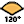
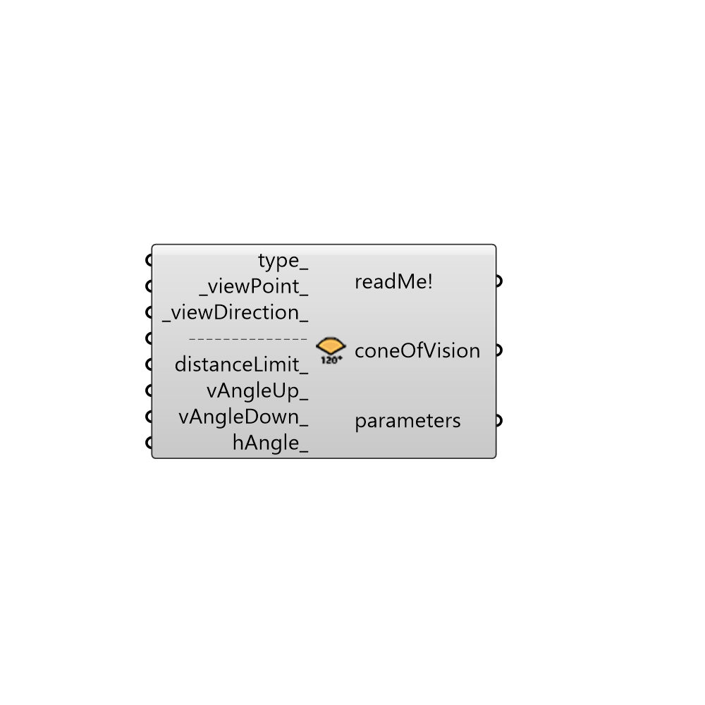

##  Cone Of Vision - [[source code]](https://github.com/ladybug-tools/ladybug-legacy/tree/master/src/Ladybug_Cone%20Of%20Vision.py)

Use this component to generate and visualize cones of vision.
 -
 This component can help you to customize view analysis. Plug its outputs into Ladybug_View Analysis.
 -
 Car at 25 mph, Car at 45 mph, Car at 65 mph (horizontal angle, distance limits)
 Source: U. S. Bureau of Land Management. Visual Resource Management Program (Course 8400-05) 2008.
 -
 Human, Color Recognition, Sign Recognition, Word Recognition (horizontal angle)
 Human, Color Recognition, Optimal Video Display Area (vertical angle)
 Source: INO - CNR Istituto Nazionale di Ottica www.ino.it Titolo: Il processo della Visione e Stereoscopia Relatore: Luca Mercatelli 16 aprile 2010 Polo viale.
 -
 

#### Inputs
* ##### type [Optional]
This input sets the cone of vision, the cone is defined by four values that are vertical angle+, vertical angle-, horizontal angle+, horizontal angle-, distance limits.
 -
 Connect a number from 0 to 9. The default is set to 0.
 -
 0 =     Human (50°, 70°, 62°, 62°, 10 meters)
 1 =     Peripheral vision (60°, 70°, 60°, 60°, 10 meters)
 2 =     Outdoor (90°, 15°, 180°, 180°, 100 meters)
 3 =     Car at 25 mph (50°, 15°, 50°, 50°, 182.88 meters)
 4 =     Car at 45 mph (50°, 15°, 33°, 32.5°, 365.76 meters)
 5 =     Car at 65 mph (50°, 15°, 22°, 20°, 609.60 meters)
 6 =     Color Recognition (30°, 40°, 30°, 30°, 10 meters)
 7 =     Sign Recognition (30°, 40°, 15°, 15°, 10 meters)
 8 =     Word Recognition (30°, 40°, 5°, 5°, 10 meters)
 9 =     Optimal Video Display Area (0°, 30°, 30°, 30°, 10 meters)
 -
 If no value is provided, it will be 2 ("Outdoor").
* ##### viewPoint [Default]
The point of vision in which to generate the cone of vision.
 If not supplied, default value will be the Rhino origin.
* ##### viewDirection [Default]
A vector that represents the view direction.
 If not supplied, default value will be the vector of Y-Axis.
* ##### distanceLimit [Optional]
Set the limit of the view.
 -
 This input let you customize the cone of vision.
* ##### vAngleUp [Optional]
The vertical angle of the upper visual field. A number from 0.0 to 90.0.
 -
 This input let you customize the cone of vision.
* ##### vAngleDown [Optional]
The vertical angle of the lower visual field. A number from 0.0 to 90.0.
 -
 This input let you customize the cone of vision.
* ##### hAngle [Optional]
The horizontal angle from the standard line of sight. A number from 0.0 to 180.0.
 -
 This input let you customize the cone of vision.

#### Outputs
* ##### readMe!
...
* ##### coneOfVision
Brep that represent the cone of vision.
* ##### parameters
Connect this list to Ladybug_View Analysis for customizing the view analysis.
 -
 the parameters are vertical angle+ (°), vertical angle- (°), horizontal angle (°), distance limit (meters), view direction in the horizontal plane (°).
 NB. 0° is the direction of green axis of Rhino.

[Check Hydra Example Files for Cone Of Vision](https://hydrashare.github.io/hydra/index.html?keywords=Ladybug_Cone Of Vision)