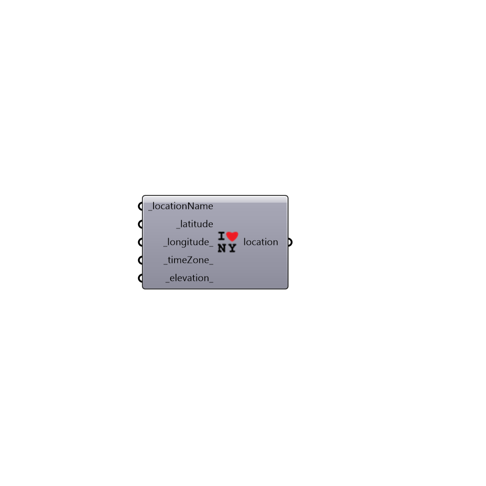

##  Construct_Location

Use this component if you do not have an .epw weather file but have a latitude or other information on the site.
 The location output of this component can be used to make a sun plot in the absence of an .epw weather file.
 -
 

#### Inputs
* ##### locationName [Required]
A name for the location you are constructing. (ie. Steventon Island, Antarctica)
* ##### latitude [Required]
The latitude of the location you are constructing. Values must be between -90 and 90. Default is set to the equator.
* ##### longitude [Default]
An optional numerical value representing the longitude of the location you are constructing. This can improve the accuracy of the resulting sun plot.
* ##### timeZone [Default]
An optional integer representing the time zone of the location you are constructing. This can improve the accuracy of the resulting sun plot.  The time zone should follow the epw convention and should be between -12 and +12, where 0 is at Greenwich, UK, positive values are to the East of Greenwich and negative values are to the West.
* ##### elevation [Default]
An optional numerical value representing the elevation of the location you are constructing.

#### Outputs
* ##### location
A list of text summarizing the location data in the weather file (use this to construct the sun path).

[Check Hydra Example Files for Construct Location](https://hydrashare.github.io/hydra/index.html?keywords=Ladybug_Construct Location)