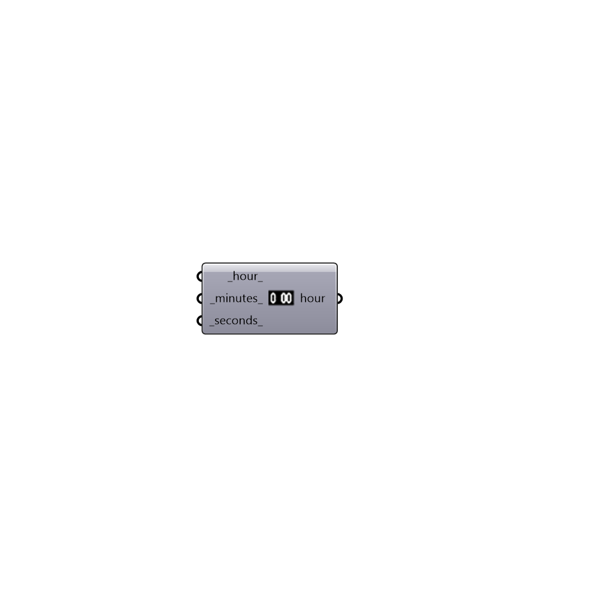

##  Construct Time

Use this component to construct a specific hour from corresponding time in hours, minutes and seconds.  The output can be plugged into the analysisPeriod or sunPath components.
 -
 

#### Inputs
* ##### hour [Default]
A number between 1 and 23 representing the hour of the day.
* ##### minutes [Default]
A number between 1 and 60 representing the minute of the hour.
* ##### seconds [Default]
A number between 1 and 60 representing the second of the minute.

#### Outputs
* ##### hour
An output hour that an be plugged into the analysisPeriod or sunPath components.

[Check Hydra Example Files for Construct Time](https://hydrashare.github.io/hydra/index.html?keywords=Ladybug_Construct Time)