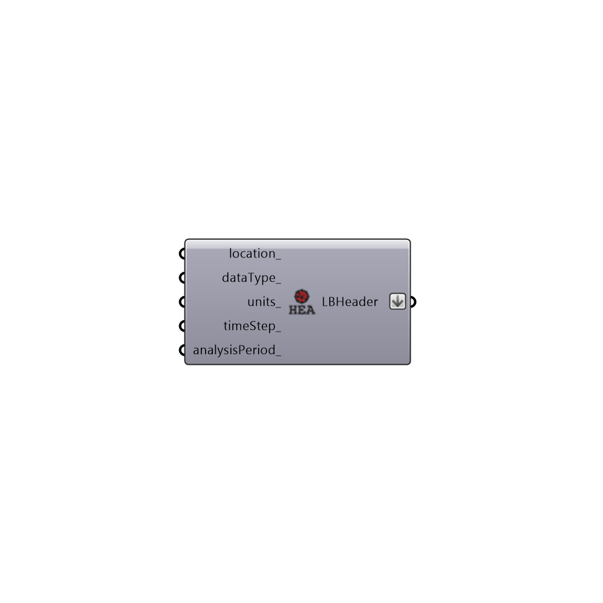

##  Create LB Header

Use this component to generates a Ladybug Header that can be combined with any raw data in order to format it for use with the Ladybug/Honeybee components.
 _
 This component is particularly useful if you are bringing in data from other plugins or from instrumental measurements and you want to visualize it or analyze it with the Ladybug and Honeybee components.  It is also useful if you want to replace the header on Ladybug data.
 -
 

#### Inputs
* ##### location [Optional]
A text string that represents the name of the location where the data was collected.  If no value is connected here, the default will be "Somewhere."
* ##### dataType [Optional]
A text string that represents the type of data that the header corresponds to.  This can be "Temperature", "Wind", etc.  If no value is connected here, the default will be "Some Data."
* ##### units [Optional]
A text string that represents the units of the data. This can be "C", "m/s", etc.  If no value is connected here, the default will be "Some Units."
* ##### timeStep [Optional]
A text string that represents the time step of the data.  Acceptable values include "Hourly", "Daily", "Monthly", or "Annually."  If no value is connected here, the default will be "Hourly."
* ##### analysisPeriod [Optional]
An optional analysis period from the Analysis Period component.  If no analysis period is given, the default will be for the enitre year: (1,1,1)(12,31,24).

#### Outputs
* ##### LBHeader
Script variable Python

[Check Hydra Example Files for Create LB Header](https://hydrashare.github.io/hydra/index.html?keywords=Ladybug_Create LB Header)