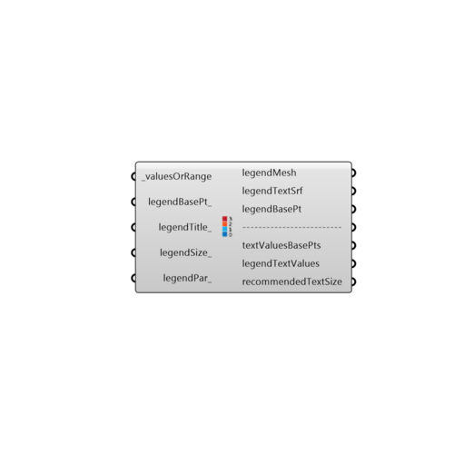

##  Create Legend

Use this component to create a custom legend for any set of data or to create a more flexible legend for any ladybug component with a legend.  Specifically, this component outputs data that can be plugged into the grasshopper "Text Tag 3D" component so that the legend text can be baked into the Rhino scene as actual text instead of surfaces representing text.
 -
 

#### Inputs
* ##### valuesOrRange [Required]
The list of numerical data that the legend refers to (or just the minimum and maximum numerical values of this data).  If the original numerical data is hooked up, the legend's maximum and minimum values will be set by the max and min of the data set.
* ##### legendBasePt [Optional]
An optional point to set the location of the legend.  This can be the output legendBasePt of any of the Ladybug components that have a legend.  If a point is hooked up here and another point is hooked up at a legendPar component that is connected to this one, the point on the legendPar component will override the input point here.
* ##### legendTitle [Optional]
A text string representing a legend title. Legends are usually titled with the units of the data.  If no text is provided here, the default title will read "unkown units."
* ##### legendSize [Optional]
The initial size of a single colored cell of the legend mesh, which determines the size of the whole legend.  This should be a numerical value corresponding to the length of a legend cell in Rhino model units.  The default is set to 10 Rhino units.
* ##### legendPar [Optional]
Optional legend parameters from the Ladybug Legend Parameters component.

#### Outputs
* ##### legendMesh
A colored mesh that corresponds to the input _valuesOrRange. Connect this output to a grasshopper "Mesh" component in order to preview this separately in the Rhino scene.  
* ##### legendTextSrf
A list of surfaces representing the text labels of the legend.  These surfaces will reflect the font and size input to the legendPar.
* ##### legendBasePt
The legend base point, which can be used to move the legend with the grasshopper "move" component.
* ##### textValuesBasePts
The base points that correspond to the title text and numerical value text of the legend.  Plug this into the "Location" input of the grasshopper "Text Tag 3D" component in order to display as text in Rhino.
* ##### legendTextValues
The text strings that correspond to the title and numerical values of the legend.  Plug this into the "Text" input of the grasshopper "Text Tag 3D" component in order to display as text in Rhino.
* ##### recommendedTextSize
Values representing recommended text sizes that correspond to the title and numerical values of the legend.  These values are generated based on the legend size and scale. Plug this into the "Size" input of the grasshopper "Text Tag 3D" component in order to display as text in Rhino.

[Check Hydra Example Files for Create Legend](https://hydrashare.github.io/hydra/index.html?keywords=Ladybug_Create Legend)