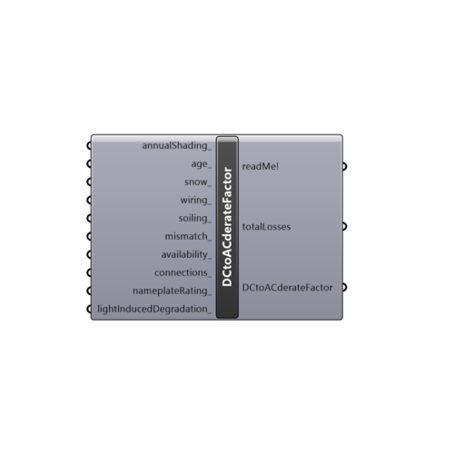

##  DC to AC derate factor

Use this component to calculate overall DC to AC derate factor for Photovoltaics Surface's "DCtoACderateFactor_" input.
 Overall DC to AC derate factor corresponds to various locations and instances in a PV system where power is lost from DC system nameplate to AC power.
 -
 Component first calculates PVWatts v5 Total losses, then converts them to PVWatts v1 overall DC to AC derate factor.
 Based on PVWatts v5 Manual: http://www.nrel.gov/docs/fy14osti/62641.pdf
 -
 If nothing supplied to the inputs, default value of 0.85 will be used.
 -
 

#### Inputs
* ##### annualShading [Optional]
Losses due to buildings, structures, trees, mountains or other objects that prevent solar radiation from reaching the cells.
 Input range: 0 to 100(%), 0 being unshaded, and 100 being totally shaded PV module.
 -
 If not supplied default value of 0(%) will be used.
* ##### age [Optional]
Losses over time due to weathering of the PV modules. The loss in performance is typically 1% per year. Example: for the 20th year of operation, an age loss of 19% would be appropriate. 
 Input range: 0 (new module) to 100%(theoretically: 101 year old module)
 -
 If not supplied default value of 0(%) will be used.
* ##### snow [Optional]
Losses due to snow covering the array. The default value is zero, assuming either that there is never snow on the array, or that the array is kept clear of snow.
 Input range: 0 (there is never snow on the array, or the array is kept clear of snow) to 100%(an array is theoretically always covered with snow)
 -
 If not supplied default value of 0(%) will be used.
* ##### wiring [Optional]
Resistive losses in the DC and AC wires connecting modules, inverters, and other parts of the system.
 Input range: 0 to 100(%)
 -
 If not supplied default value of 2(%) will be used.
* ##### soiling [Optional]
Losses due to dust, dirt, leaves, other wildlife droppings, snow, and other foreign matter on the surface of the PV module that prevent solar radiation from reaching the cells. Soiling is location- and weather-dependent. There are greater soiling losses in high-traffic, high-pollution areas with infrequent rain.
 Input range: 0 to 100(%)
 -
 If not supplied default value of 2(%) will be used.
* ##### mismatch [Optional]
Electrical losses due to slight differences caused by manufacturing imperfections between modules in the array that cause the modules to have slightly different current-voltage characteristics.
 Input range: 0 to 100(%)
 -
 If not supplied default value of 2(%) will be used.
* ##### availability [Optional]
Losses due to scheduled and unscheduled system shutdown for maintenance, grid outages, and other operational factors.
 Input range: 0 to 100%
 -
 If not supplied default value of 3(%) will be used.
* ##### connections [Optional]
Resistive losses in electrical connectors in the system.
 Input range 0 to 100(%)
 -
 If not supplied default value of 0.5(%) will be used.
* ##### nameplateRating [Optional]
Losses due to accuracy of the manufacturer's nameplate rating. Field measurements of the electrical characteristics of photovoltaic modules in the array may show that they differ from their nameplate rating. Example: a nameplate rating loss of 5% indicates that testing yielded power measurements at STC that were 5% less than the manufacturer's nameplate rating.
 Input range 0 to 100(%)
 -
 If not supplied default value of 1(%) will be used.
* ##### lightInducedDegradation [Optional]
Effect of the reduction in the array's power during the first few months of its operation caused by light-induced degradation of photovoltaic cells.
 Input range 0 to 100(%)
 -
 If not supplied default value of 1.5(%) will be used.

#### Outputs
* ##### readMe!
...
* ##### totalLosses
PVWatts v5 representation of DCtoACderateFactor factor.
 In percent (%).
* ##### DCtoACderateFactor
Factor which accounts for various locations and instances in a PV system where power is lost from DC system nameplate to AC power.
 Unitless.

[Check Hydra Example Files for DC to AC derate factor](https://hydrashare.github.io/hydra/index.html?keywords=Ladybug_DC to AC derate factor)