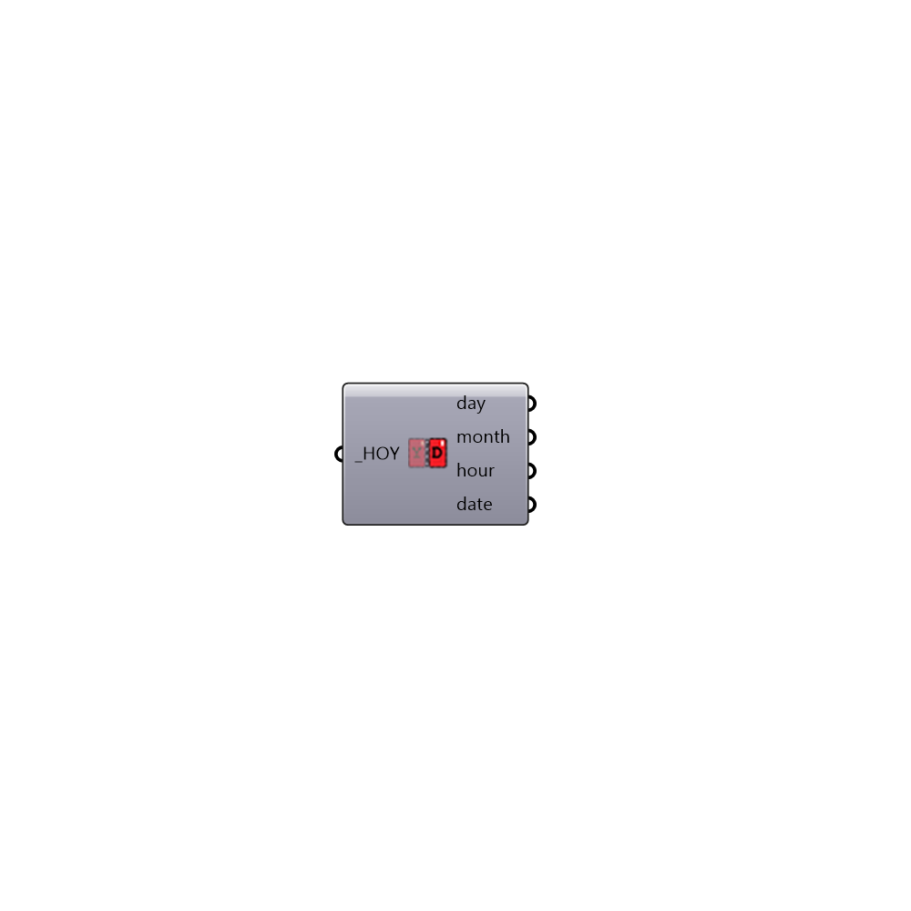

##  Day_Month_Hour

Use this component to calculate date information from an hour of the year.  Date information includes the day of the month, the month of the year and the hour of the day.
 -
 

#### Inputs
* ##### HOY [Required]
Hour of the year

#### Outputs
* ##### day
The day of the month on which the input HOY falls.
* ##### month
The month of the year on which the input HOY falls.
* ##### hour
The hour of the day on which the input HOY falls.
* ##### date
The input information written out as a full date and time text string.

[Check Hydra Example Files for Day_Month_Hour](https://hydrashare.github.io/hydra/index.html?keywords=Ladybug_Day_Month_Hour)