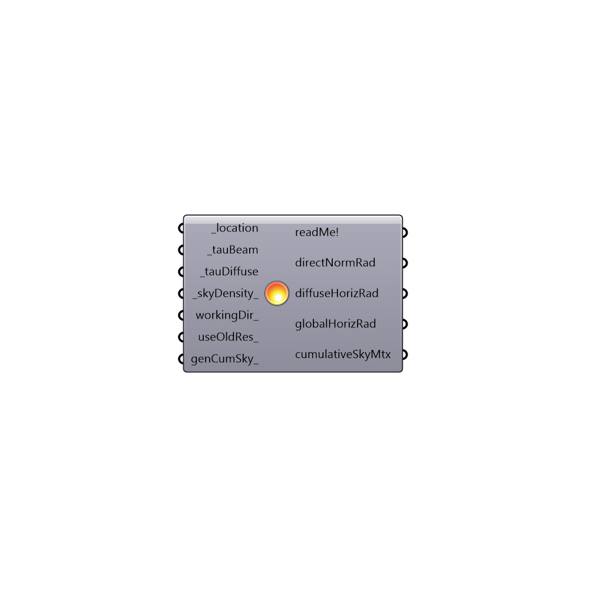

##  Design Day Sky Model - [[source code]](https://github.com/mostaphaRoudsari/ladybug/tree/master/src/Ladybug_Design%20Day%20Sky%20Model.py)

Use this component to generate a clear sky for a cooling design day, which can then be used to size a HVAC system.  This component outputs both the hourly solar radiation values as well as a cumulative sky that can be used in solar radiation studies (if requested).
 _
 Specifically, this component uses the ASHRAE Revised Clear Sky Model (“Tau Model”), which was originally published in the ASHRAE 2009 Handbook of Fundementals (American Society of Heating, Refrigerating and Air-Conditioning Engineers. (2009). 2009 ASHRAE handbook: Fundamentals. Atlanta, GA: American Society of Heating, Refrigeration and Air-Conditioning Engineers).
 The "Tau Model" is currently the recommended sky model for cooling design day calculations and is the default assumption of Honeybee EnergyPlus HVAC sizing calculations.
 _
 More information on the calculation for the can be found in the EnergyPlus Input/Output reference:
 http://bigladdersoftware.com/epx/docs/8-4/engineering-reference/climate-calculations.html#ashrae-revised-clear-sky-model-tau-model
 -
 

#### Inputs
* ##### location [Required]
The output from the importEPW or constructLocation component.  This is essentially a list of text summarizing a location on the earth.
* ##### tauBeam [Required]
Values representing the optical sky depth for beam (direct) solar radiation.  Optical depth is the natural logarithm of the ratio of incident to transmitted radiant power through the atmosphere.  It can vary from month to month as water vapor concentrations in the atmosphere change.  This input can be either a single value for the whole year, a list of 12 monthly values, or the output from the "Ladybug_Import stat" component.  Typical values range from 0.3 in cool dry months to 0.65 in warm humid months.
* ##### tauDiffuse [Required]
Values representing the optical sky depth for diffuse solar radiation.  Optical depth is the natural logarithm of the ratio of incident to transmitted radiant power through the atmosphere.  It can vary from month to month as water vapor concentrations in the atmosphere change. This input can be either a single value for the whole year, a list of 12 monthly values, or the output from the "Ladybug_Import stat" component. Typical values range from 1.75 in warm humid months to 2.5 in cool dry months.
* ##### skyDensity [Default]
Set to 0 to generate a Tregenza sky, which will divide up the sky dome with a coarse density of 145 sky patches.  Set to 1 to generate a Reinhart sky, which will divide up the sky dome using a very fine density of 580 sky patches.  Note that, while the Reinhart sky is more accurate, it will result in considerably longer calculation times.  Accordingly, the default is set to 0 for a Tregenza sky.
* ##### workingDir [Optional]
An optional working directory in your system where the sky will be generated. Default is set to C:\Ladybug or C:\Users\yourUserName\AppData\Roaming\Ladybug.  The latter is used if you cannot write to the C:\ drive of your computer.  Any valid file path location can be connected.
* ##### useOldRes [Optional]
Set this to "True" if you have already run this component previously and you want to use the already-generated data for this weather file.
* ##### genCumSky [Optional]
Set to 'True' to have this component generate a cumulative sky matrix for the design day sky.  This can then be used in Ladybug solar radiation studies and visualized with the "Ladybug_Sky Dome" or "Ladybug_Radiation Rose."

#### Outputs
* ##### readMe!
...
* ##### directNormRad
The hourly Direct Normal Radiation in Wh/m2 for an ASHRAE Revised Clear Sky (“Tau Model”). Direct normal radiation is the amount of solar radiation in Wh/m2 received directly from the solar disk on a surface perpendicular to the sun's rays.
* ##### diffuseHorizRad
The hourly Diffuse Horizontal Radiation in Wh/m2 for an ASHRAE Revised Clear Sky (“Tau Model”). Diffuse horizontal radiation is the amount of solar radiation in Wh/m2 received from the sky (excluding the solar disk) on a horizontal surface.
 globalHorizRad; The hourly Global Horizontal Radiation in Wh/m2 for an ASHRAE Revised Clear Sky (“Tau Model”). Diffuse horizontal radiation is the total amount of direct and diffuse solar radiation in Wh/m2 received on a horizontal surface.
* ##### globalHorizRad
Script variable DesignDaySky
* ##### cumulativeSkyMtx
The result of the gendaymtx function. Use the selectSkyMtx component to select a desired sky matrix from this output for use in a radiation study, radition rose, or sky dome visualization.

[Check Hydra Example Files for Design Day Sky Model](https://hydrashare.github.io/hydra/index.html?keywords=Ladybug_Design Day Sky Model)