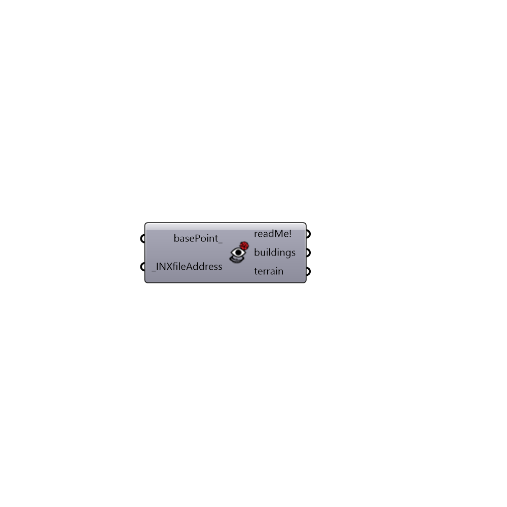

##  ENVI-Met Display - [[source code]](https://github.com/mostaphaRoudsari/ladybug/tree/master/src/Ladybug_ENVI-Met%20Display.py)

Use this component to visualize ENVI-Met v4.0 3D geometry models.
 -
 

#### Inputs
* ##### basePoint [Optional]
Input a point here to move ENVI-Met grid. If no input is provided it will be origin point.
* ##### INXfileAddress [Required]
Output which comes from "ENVI-Met Spaces" or a complete file path of a INX file on your machine.

#### Outputs
* ##### readMe!
...
* ##### buildings
ENVI-Met buildings preview.
* ##### terrain
ENVI-Met terrain preview.

[Check Hydra Example Files for ENVI-Met Display](https://hydrashare.github.io/hydra/index.html?keywords=Ladybug_ENVI-Met Display)