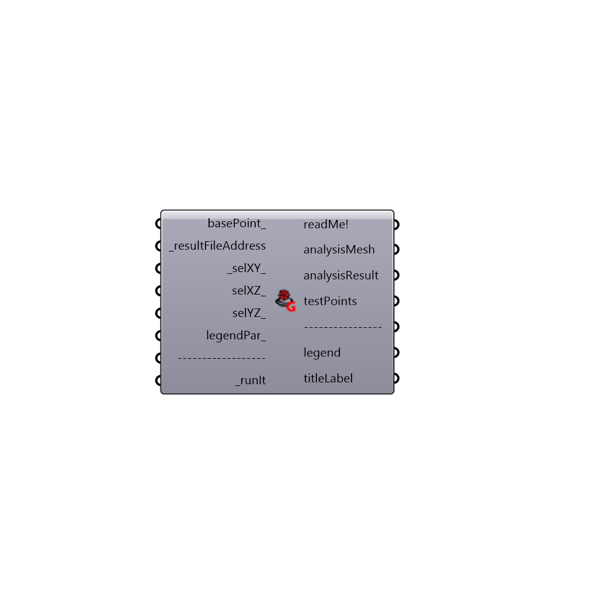

##  ENVI-Met Grid - [[source code]](https://github.com/mostaphaRoudsari/ladybug/tree/master/src/Ladybug_ENVI-Met%20Grid.py)

Use this component to visualize ENVI-Met v4.0 data. Connect "resultFileAddress" which comes from ENVI-Met reader.
 -
 Component mainly based on:
 https://www.researchgate.net/publication/281031049_Outdoor_Comfort_the_ENVI-BUG_tool_to_evaluate_PMV_values_point_by_point
 -
 

#### Inputs
* ##### basePoint [Optional]
Input a point here to move ENVI-Met grid. If no input is provided it will be origin point.
* ##### resultFileAddress [Required]
Output comes from "ENVI-Met Reader".
* ##### selXY [Default]
Connect an integer to generate a XY section. Plug a panel to "readMe!" for more info.
 -
 Default value is 0.
* ##### selXZ [Optional]
Connect an integer to generate a XZ section. Plug a panel to "readMe!" for more info.
* ##### selYZ [Optional]
Connect an integer to generate a YZ section. Plug a panel to "readMe!" for more info.
* ##### legendPar [Optional]
Optional legend parameters from the Ladybug Legend Parameters component.
* ##### runIt [Required]
Set to "True" to run the component and perform ENVI-Met data visualization.

#### Outputs
* ##### readMe!
...
* ##### analysisMesh
Analysis grid of ENVI-Met (XY plane, ZX plane and ZY plane).
* ##### analysisResult
Values corrisponding to each analysis Grid.
* ##### testPoints
Test points on grids.
* ##### legend
Legend geometry of ENVI-Met Grid.
* ##### titleLabel
Title geometry with information about project name, location, and date.

[Check Hydra Example Files for ENVI-Met Grid](https://hydrashare.github.io/hydra/index.html?keywords=Ladybug_ENVI-Met Grid)