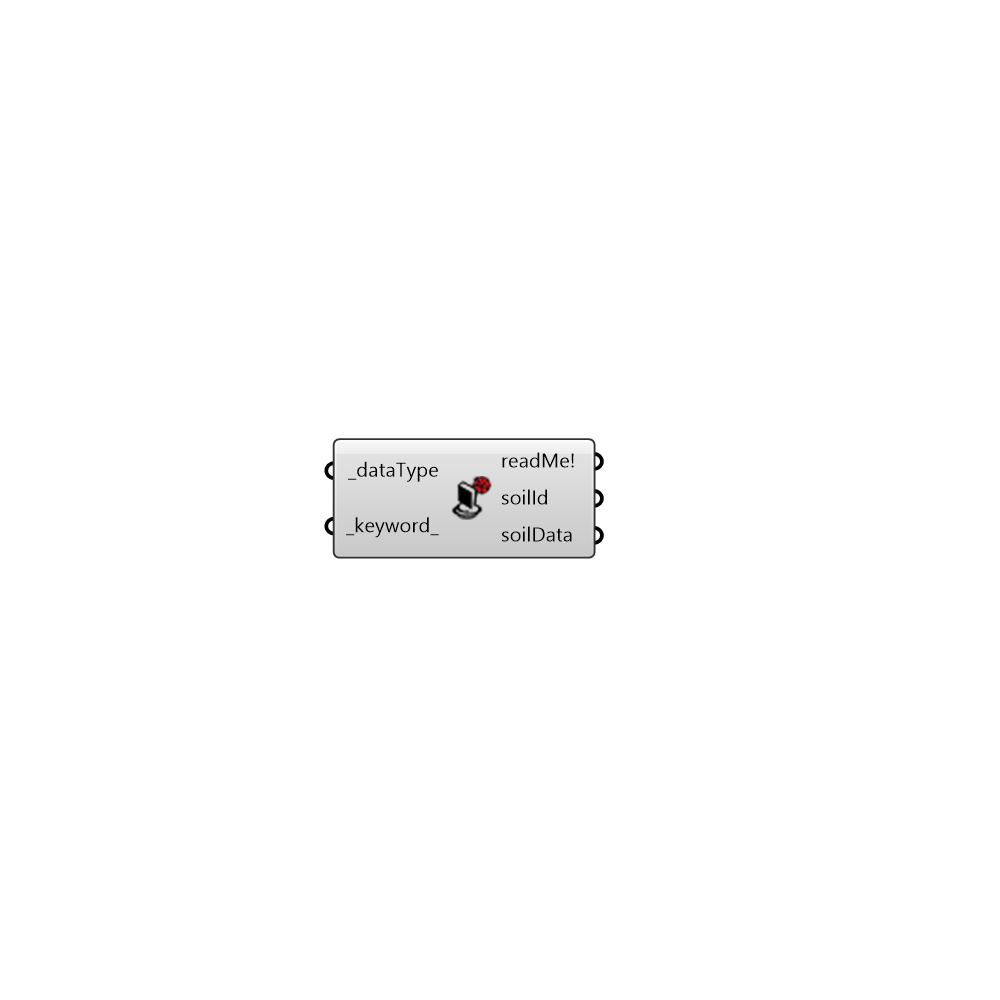

##  ENVI-Met Read Library

This component let you select materials from ENVI-Met library.
 -
 

#### Inputs
* ##### dataType [Required]
Connect an integer from 0 to 6.
 -
 0 = soil
 1 = profile
 2 = material
 3 = wall
 4 = source
 5 = plant
 6 = plant3D
 -
 Default value is 0.
* ##### keyword [Default]
Connect a keyword to filter data. E.g. 'asphalt' (_dataType = 0)

#### Outputs
* ##### readMe!
...
* ##### soilId
ENVI-Met soil ID.
* ##### soilData
0 = Id 1 = Description 2 = Versiegelung 3 = Water Contentat Saturation 4 = Water Content At Field Cap 5 = WaterContentWiltingPoint6 = Matrix Potential 7 = Hidraulic Conductivity 8 = Volumetric HeatCapacity 9 = Clapp Constant 10 = Heat Conductivity 11 = Group 12 = Color

[Check Hydra Example Files for ENVI-Met Read Library](https://hydrashare.github.io/hydra/index.html?keywords=Ladybug_ENVI-Met Read Library)