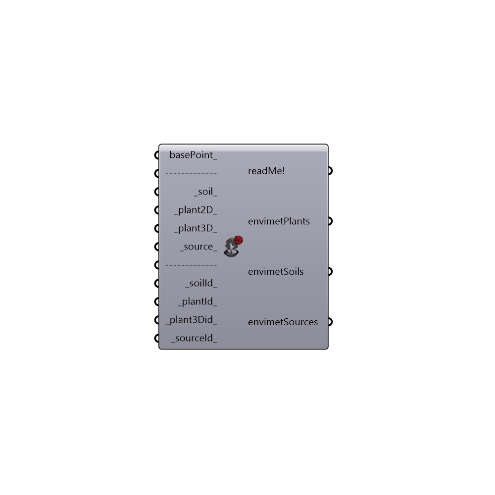

##  ENVI-Met Soil Plant Source

Use this component to generate ENVI-Met inputs for "LB ENVI-Met Spaces".
 -
 Some 'plant3Did_' could not work properly.
 -
 

#### Inputs
* ##### basePoint [Optional]
Input a point here to move ENVI-Met grid. If no input is provided it will be origin point.
* ##### soil [Default]
Geometry that represent ENVI-Met soil.  Geometry must be a Surface or Brep on xy plane.
* ##### plant2D [Default]
Geometry that represent ENVI-Met plant 2d.  Geometry must be a Surface or Brep on xy plane.
* ##### plant3D [Default]
Geometry that represent ENVI-Met plant 3d.  Geometry must be a Surface or Brep on xy plane.
* ##### source [Default]
Geometry that represent ENVI-Met plant 3d.  Geometry must be a Surface or Brep on xy plane.
* ##### soilId [Default]
ENVI-Met profile id. You can use "id outputs" which comes from "LB ENVI-Met Read Library".
 -
 E.g. L0
* ##### plantId [Default]
ENVI-Met plant id. You can use "id outputs" which comes from "LB ENVI-Met Read Library".
 -
 E.g. XX
* ##### plant3Did [Default]
ENVI-Met plant3D id. You can use "id outputs" which comes from "LB ENVI-Met Read Library".
 -
 E.g. PI,.Pinus Pinea
* ##### sourceId [Default]
ENVI-Met source id. You can use "id outputs" which comes from "LB ENVI-Met Read Library".
 -
 E.g. FT

#### Outputs
* ##### readMe!
...
* ##### envimetPlants
Connect this output to "ENVI-Met Spaces" in order to add plants to ENVI-Met model.
* ##### envimetSoils
Connect this output to "ENVI-Met Spaces" in order to add soils to ENVI-Met model.
* ##### envimetSources
Connect this output to "ENVI-Met Spaces" in order to add sources to ENVI-Met model.

[Check Hydra Example Files for ENVI-Met Soil Plant Source](https://hydrashare.github.io/hydra/index.html?keywords=Ladybug_ENVI-Met Soil Plant Source)