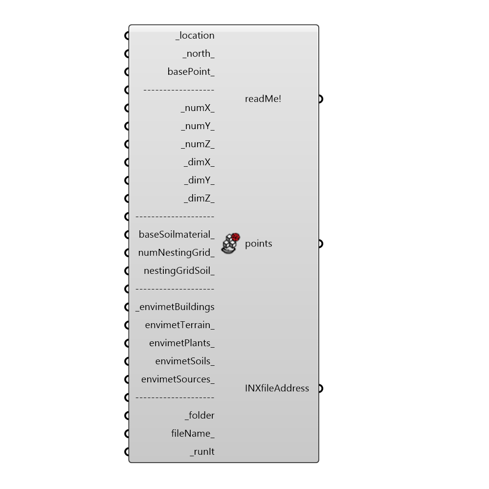

##  ENVI-Met Spaces - [[source code]](https://github.com/mostaphaRoudsari/ladybug/tree/master/src/Ladybug_ENVI-Met%20Spaces.py)

Use this component to generate ENVI-Met v4.0 3D geometry models.
 -
 Analyze parametric models with ENVI-Met!
 -
 Save the model in the ENVI_MET Workspace, set the simulation file with ENVI_MET ConfigWizard and run the simulation.
 N.B. It can write files with equidistant grid only. If you want to visualize INX file with ENVI_MET SPACES you need to use "Open 3D view".
 -
 

#### Inputs
* ##### location [Required]
The output from the importEPW or constructLocation component.  This is essentially a list of text summarizing a location on the earth.
* ##### north [Default]
Input a number between 0 and 360 that represents the degrees off from the y-axis to make North.  The default North direction is set to the Y-axis (0 degrees).
* ##### basePoint [Optional]
Input a point here to move ENVI-Met grid. If no input is provided it will be origin point.
* ##### numX [Default]
Number of grid cells in base plane x direction. Default value is 20.
* ##### numY [Default]
Number of grid cells in base plane y direction. Default value is 20.
* ##### numZ [Default]
Number of grid cells in base plane z direction. Default value is 20.
* ##### dimX [Default]
Size of grid cell in meter. Default value is 3.0.
* ##### dimY [Default]
Size of grid cell in meter. Default value is 3.0.
* ##### dimZ [Default]
Size of grid cell in meter. Default value is 3.0.
* ##### baseSoilmaterial [Optional]
Connect a profileId that you want to use as base material of soil. If no id is provided it will be 'LO'.
* ##### numNestingGrid [Optional]
Connect an integer to set nesting grid around main area. If no input is connected this will be 3.
* ##### nestingGridSoil [Optional]
Connect two envimet ID soils to set soil profile for nesting grids. Use "LB ENVI-Met Read Library" for that.
 -
 If no input is connected this input will be ('LO', 'LO').
* ##### envimetBuildings [Required]
Output which comes from "LB ENVI-Met Building Terrain".
* ##### envimetTerrain [Optional]
Output which comes from "LB ENVI-Met Building Terrain".
* ##### envimetPlants [Optional]
Output which comes from "LB ENVI-Met Soil Plant Source".
* ##### envimetSoils [Optional]
Output which comes from "LB ENVI-Met Soil Plant Source".
* ##### envimetSources [Optional]
Output which comes from "LB ENVI-Met Soil Plant Source".
* ##### folder [Required]
The folder into which you would like to write the envimet model. This should be a complete file path to the folder.
* ##### fileName [Optional]
The file name that you would like the envimet model to be saved as. Default name is "LBenvimet".
* ##### runIt [Required]
Set to "True" to run the component and generate the envimet model.

#### Outputs
* ##### readMe!
...
* ##### points
Preview of 3D grid of points.
* ##### INXfileAddress
The file path of the inx result file that has been generated on your machine.

[Check Hydra Example Files for ENVI-Met Spaces](https://hydrashare.github.io/hydra/index.html?keywords=Ladybug_ENVI-Met Spaces)