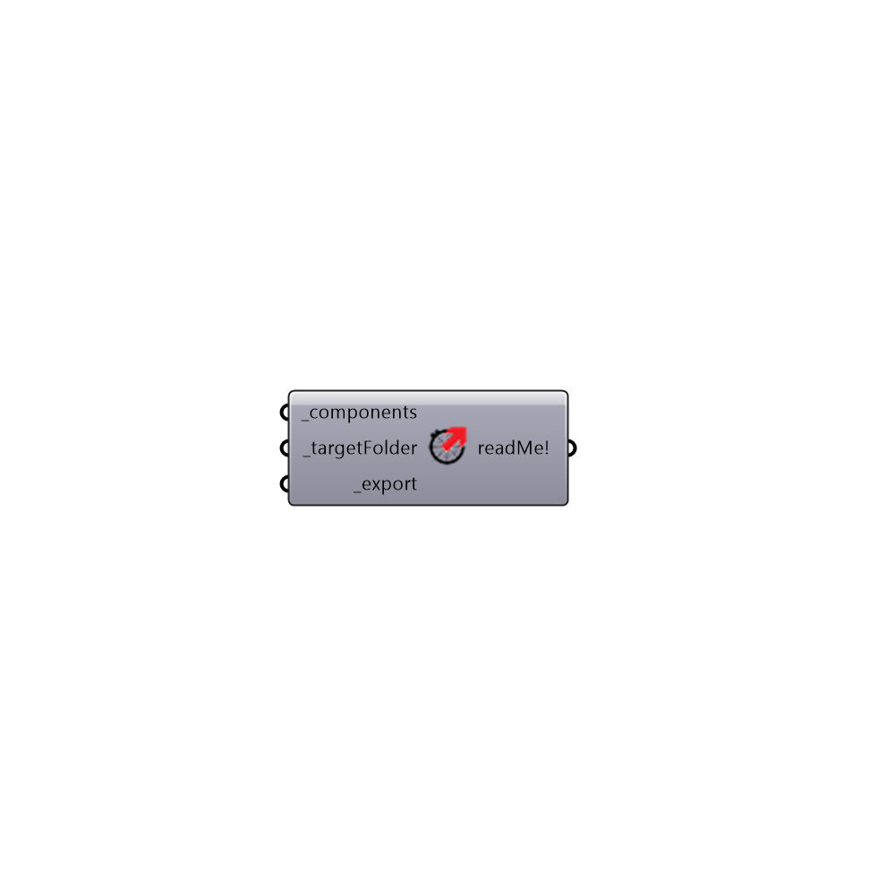

##  Export Ladybug

Code Developers of Ladybug and Honeybee can use this component to export Ladybug/Honeybee user objects and source code that they create to the Github folder on their computer.
 This eases and automates the steps before commiting new components to the Github.
 This component was written thanks to Giulio Piacentino a really helpful example.
 -
 

#### Inputs
* ##### components [Required]
Any output from a new Ladybug (or Honeybee) component that you wish to export. Right now, only one component can be connected at a time but you can input a "*" (without quotation marsk) to search all changed Ladybug components on a grasshopper canvas.
* ##### targetFolder [Required]
A file path on your system which you would like to export the user object and source code to.  For most code developers, this file path will lead to their Github folder for Ladybug (or Honeybee), which is usually installed in "My Documents" by default. Exported source code will be saved at .\src and exported userObjects will be saved at .\userObjects in this _targetFolder.
* ##### export [Required]
Set to "True" to export Ladybug (or Honeybee) components to the _targerFolder.

#### Outputs
* ##### readMe!
...

[Check Hydra Example Files for Export Ladybug](https://hydrashare.github.io/hydra/index.html?keywords=Ladybug_Export Ladybug)