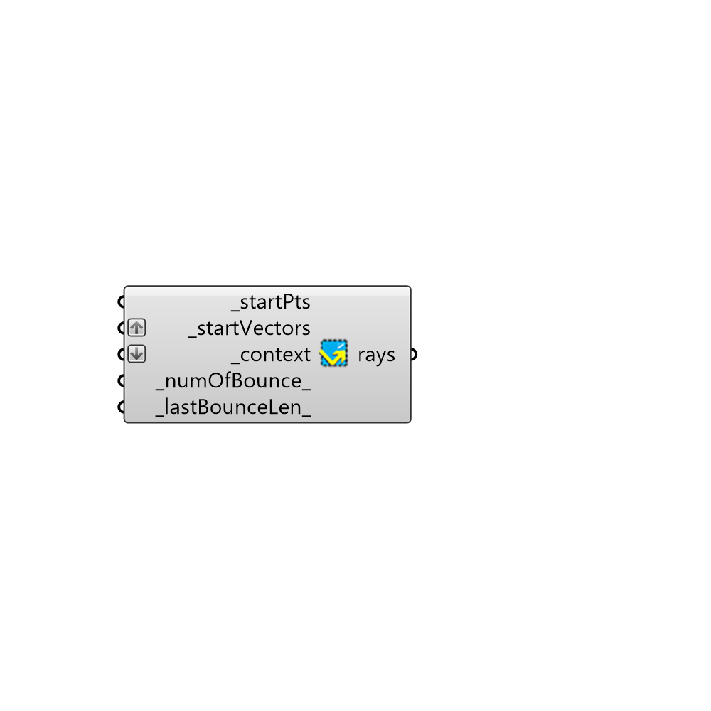

##  Forward_Raytracing

Use this component to get a sense of how sunlight is reflected by a set of context geometries by tracing sun rays forwards through this geometry.
 Examples where this component might be useful include the evaluation of the diffusion of light by a light shelf, or testing to see whether a parabolic building geometry (like a Ghery building) might focus sunlight to dangerous levels at certain times of the year.
 Note that this component assumes that all sun light is reflected off of these geometries specularly (as if they were a mirror) and, for more detailed raytrace analysis, the Honeybee daylight components should be used.
 -
 

#### Inputs
* ##### _startPts [Required]
Points from which the sun rays will be cast towards the _context geometry.  You may want to connect a grid of points here to mimic the fact that direct sun will be streaming evenly from the sky.
* ##### _startVectors [Required]
A sun vector from the sunPath component or a list of sun vectors to be forward ray-traced.
* ##### _context [Required]
Breps or meshes of conext geometry that will reflect the sun rays.  Note that, for curved surfaces, smooth meshes of the geometry will be more accurate than inputing a Brep.
* ##### _numOfBounce_ [Default]
An interger representing the number of ray bounces to trace the sun rays forward.
* ##### _lastBounceLen_ [Default]
A float number representing the length in Rhino model units of the light ray after the last bounce.

#### Outputs
* ##### rays
A series of line curves representing light rays traced forward through the geometry.

[Check Hydra Example Files for Forward Raytracing](https://hydrashare.github.io/hydra/index.html?keywords=Ladybug_Forward Raytracing)