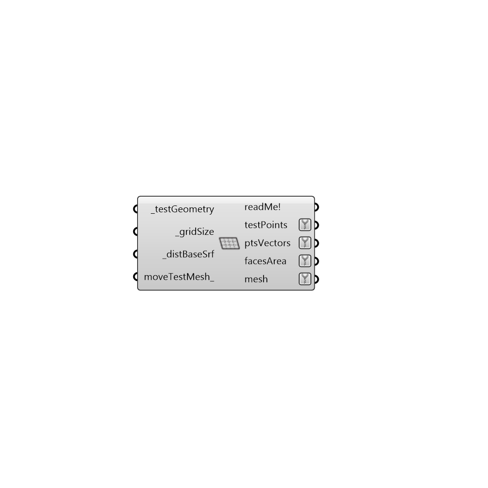

##  Generate Mesh

Use this component to genrate a mesh with corresponding test points.  The resulting mesh will be in a format that the Recolor Mesh component will accept.
 -
 

#### Inputs
* ##### testGeometry [Required]
Test surface as a Brep.
* ##### gridSize [Required]
Size of the test grid.
* ##### distBaseSrf [Required]
Distance from base surface.
* ##### moveTestMesh [Optional]
Set to 'False' if you want test mesh not to move. Default is 'True'.

#### Outputs
* ##### readMe!
...
* ##### testPoints
Test points
* ##### ptsVectors
Vectors
* ##### facesArea
Script output facesArea.
* ##### mesh
Analysis mesh

[Check Hydra Example Files for Generate Mesh](https://hydrashare.github.io/hydra/index.html?keywords=Ladybug_Generate Mesh)