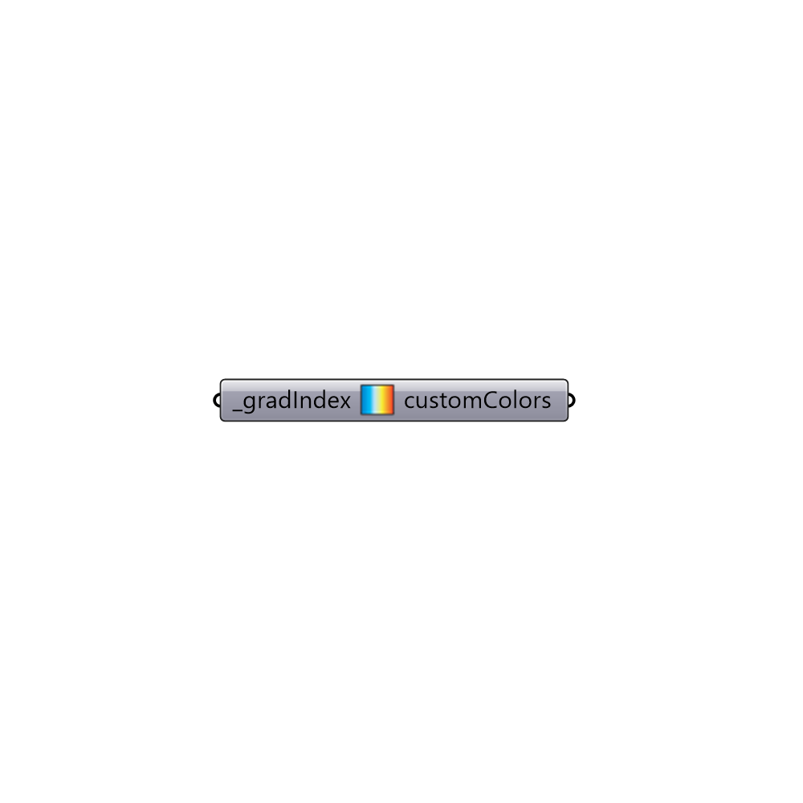

##  Gradient Library

Use this component to access a library of typical gradients useful throughout Ladybug.  The output from this component should be plugged into the customColors_ input of the "Ladybug_Legend Parameters" component.
 _
 For an image of each of the gardients in the library, check here:
 https://github.com/mostaphaRoudsari/ladybug/blob/master/resources/gradients.jpg
 -
 

#### Inputs
* ##### gradIndex [Required]
An index refering to one of the following possible gradients:
 0 - Orignal Ladybug
 1 - Nuanced Ladybug
 2 - Multi-colored Ladybug
 3 - View Analysis 1
 4 - View Analysis 2 (Red,Green,Blue)
 5 - Sunlight Hours
 6 - Ecotect
 7 - Thermal Comfort Percentage
 8 - Thermal Comfort Colors
 9 - Thermal Comfort Colors (UTCI)
 10 - Hot Hours
 11 - Cold Hours
 12 - Shade Benefit/Harm
 13 - Thermal Comfort Colors v2 (UTCI)
 14 - Shade Harm
 15 - Shade Benefit
 16 - Black to White
 17 - CFD Colors 1
 18 - CFD Colors 2
 19 - Energy Balance
 20 - THERM
 21 - Blue to Yellow

#### Outputs
* ##### customColors
A series of colors to be plugged into the "Ladybug_Legend Parameters" component.

[Check Hydra Example Files for Gradient Library](https://hydrashare.github.io/hydra/index.html?keywords=Ladybug_Gradient Library)