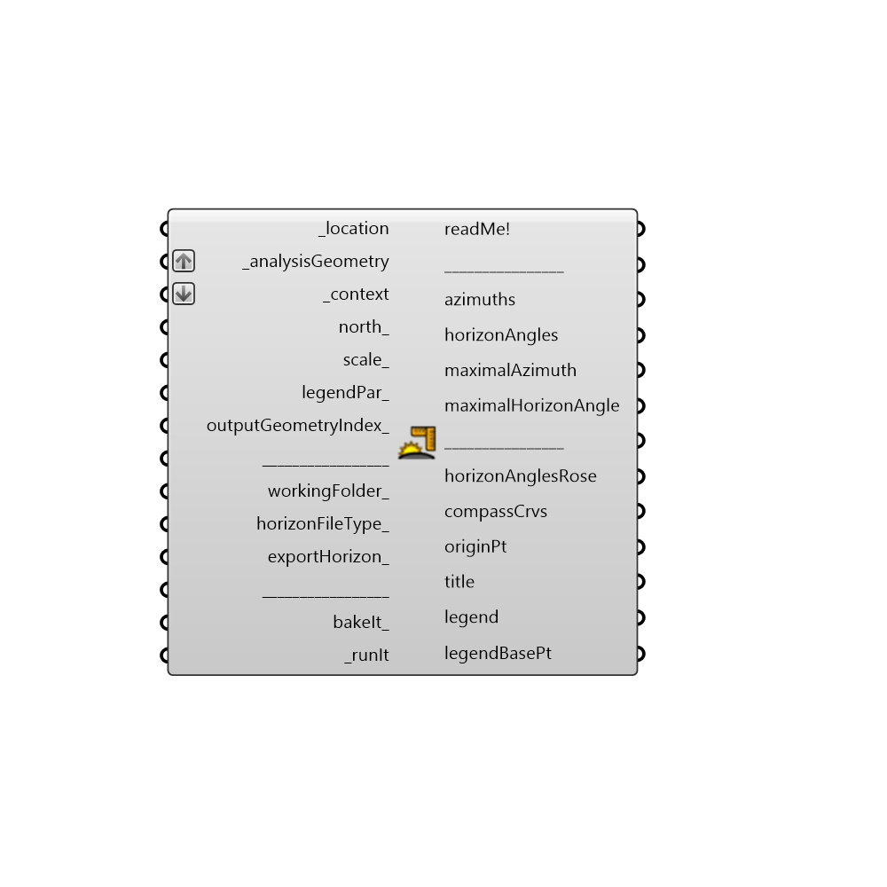

##  Horizon Angles

Use this component to create a horizon file (.hor) and visualize horizon angles.
 -
 Component based on:
 "Solmetric SunEye 210 User’s Guide", Solmetric Corporation, 2011
 http://resources.solmetric.com/get/Solmetric%20SunEye%20200%20Series%20Users%20Guide_en.pdf
 "PVsyst 6 Help", PVsyst SA
 http://files.pvsyst.com/help/index.html?horizon_import.htm
 -
 

#### Inputs
* ##### location [Required]
The output from the "importEPW" or "constructLocation" component.  This is essentially a list of text summarizing a location on the Earth.
 -
 "timeZone" and "elevation" data from the location, are not important for this component.
* ##### analysisGeometry [Required]
Input surface(a) or point(b) (a single one or more of them).
 -
 a) Input planar Surface (not polysurface) on which the PV modules/Solar water heating collectors will be applied.
 If you have a polysurface, explode it (using "Deconstruct Brep" component) and then feed its Faces(F) output to _analysisGeometry. Surface normal should be faced towards the sun.
 -
 b) You can also supply point(s).
 For example the "originPt" output from "Terrain shading mask" component.
* ##### context [Required]
Input the "terrainShadingMask" output from "Terrain shading mask" component.
 You can additionally input other opaque obstacles surrounding your location: houses, buildings etc.
 Do not input trees, as they are not opaque obstacles and should not be taken into account when analysing the horizon angles.
* ##### north [Optional]
Input a vector to be used as a true North direction, or a number between 0 and 360 that represents the clockwise degrees off from the Y-axis.
 -
 If not supplied, default North direction will be set to the Y-axis (0 degrees).
* ##### scale [Optional]
Scale of the overall geometry (horizonAnglesRose mesh, compassCrvs, title, legend).
 -
 If not supplied, default value of 1 will be used.
* ##### legendPar [Optional]
Optional legend parameters from the Ladybug "Legend Parameters" component.
* ##### outputGeometryIndex [Optional]
An index of the surface or point inputted into "_analysisGeometry" if "_analysisGeometry" would be flattened..
 It determines the surface or point for which output geometry will be generated.
 -
 If not supplied, geometry for the first surface (index: 0) will be generated as a default.
* ##### workingFolder [Optional]
Folder path where .hor files will be created (exported)
 -
 If not supplied, the default Ladybug folder path will be used: C:\ladybug or C:\Users\%USERNAME%\AppData\Roaming\Ladybug.
* ##### horizonFileType [Optional]
The following .hor file types are supported:
 -
 0 - Meteonorm
 1 - PV*SOL
 2 - PVsyst 5 and PVsyst 6
 3 - PVsyst 4
 -
 If software you intend to use your .hor file to, is not listed above, it's the best to use the horizonFileType 0 (Meteonorm). This type is universal and supported with most sun related applications. Though, it does lack the data about the location, coordinates, altitude etc.
 This type is also mandatory for both Meteonorm 6 and Meteonorm 7.
 -
 If not supplied 0 (Meteonorm 6 and Meteonorm 7) will be used by default.
* ##### exportHorizon [Optional]
Set to "True" to bake export(create) a .hor file.
 -
 If not supplied default value "False" will be used.
* ##### bakeIt [Optional]
Set to "True" to bake the Horizon angles rose into the Rhino scene.
 -
 If not supplied default value "False" will be used.
* ##### runIt [Required]
...

#### Outputs
* ##### readMe!
...
* ##### azimuths
Azimuth angles (directions) in range from 0 to 360 measured clockwise from true North.
 -
 In degrees.
* ##### horizonAngles
Horizon (sky view) angles which correspond to each azimuth.
 -
 In degrees.
* ##### maximalAzimuth
Direction which corresponds to the maximalHorizonAngle below.
 -
 In degrees.
* ##### maximalHorizonAngle
Maximal horizon angle.
 -
 In degrees.
* ##### horizonAnglesRose
A mesh representing horizon angles for each azimuth.
* ##### compassCrvs
Compass azimuth labels and curves.
* ##### originPt
The origin (center) point of the inputted "_context" geometry.
 It's basically equal to the "_origin" input.
 -
 Use this point to move "horizonAnglesRose", "compassCrvs" and "title" geometry around in the Rhino scene with grasshopper's "Move" component.
* ##### title
Title geometry with information about location.
* ##### legend
Legend of the horizonAnglesRose.
* ##### legendBasePt
Legend base point, which can be used to move the "legend" geometry with grasshopper's "Move" component.
 -
 Connect this output to a Grasshopper's "Point" parameter in order to preview the point in the Rhino scene.

[Check Hydra Example Files for Horizon Angles](https://hydrashare.github.io/hydra/index.html?keywords=Ladybug_Horizon Angles)