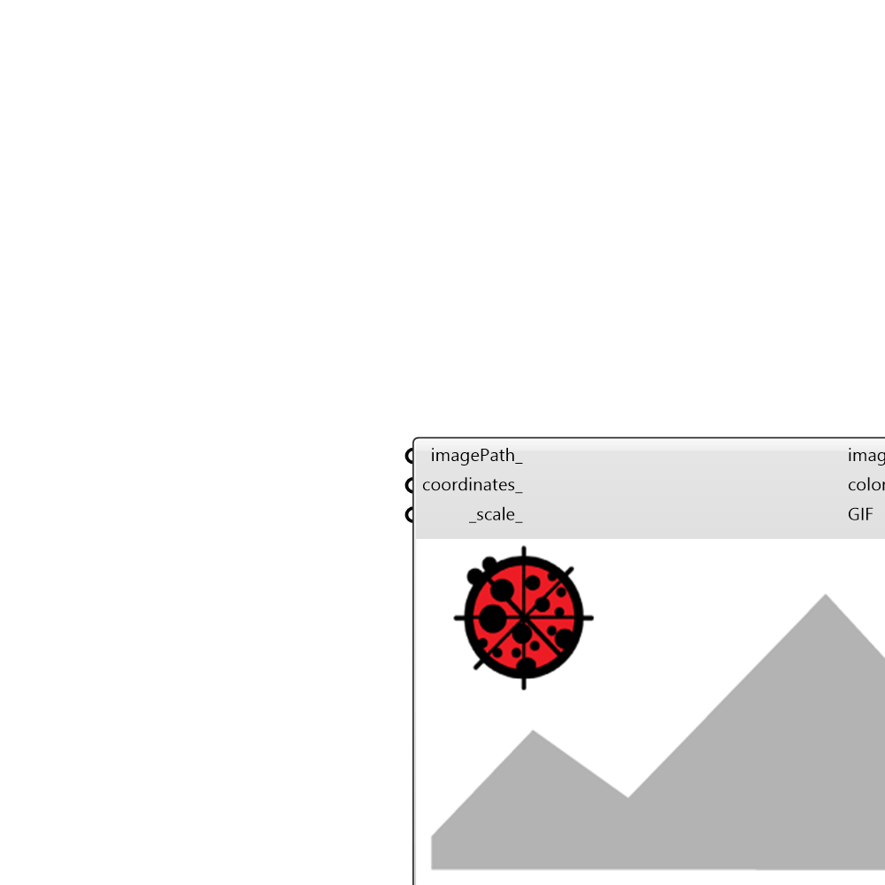

##  ImageViewer - [[source code]](https://github.com/mostaphaRoudsari/ladybug/tree/master/src/Ladybug_ImageViewer.py)

Preview image files

#### Inputs
* ##### imagePath [Optional]
one or a list of image file path.
* ##### coordinates [Optional]
A list of points for extracting colors from the source image.
* ##### scale [Default]
Set this image viewport scale.

#### Outputs
* ##### imagePath
A new image marked with coordinates.
* ##### colors
Color infomation that extracted from the input image.
* ##### GIF
Generates an animated gif image when there is a list of images.

[Check Hydra Example Files for ImageViewer](https://hydrashare.github.io/hydra/index.html?keywords=Ladybug_ImageViewer)