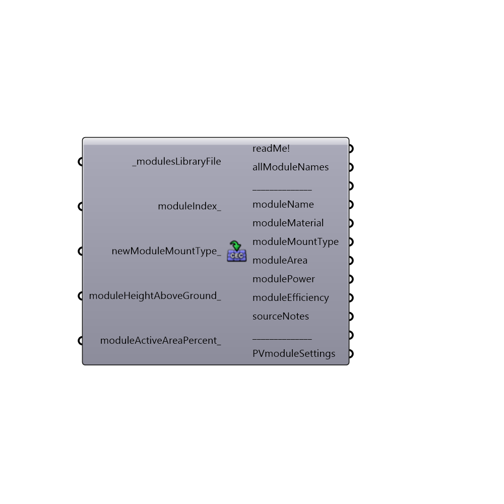

##  Import CEC Photovoltaics Module

Use this component to import Photovoltaics module settings for particular module from "California Energy Commission (CEC) Modules" library.
 Download library's newest version from the bottom of the following page:
 https://sam.nrel.gov/libraries
 -
 

#### Inputs
* ##### modulesLibraryFile [Required]
Add "California Energy Commission (CEC) Modules" .csv file path to this input.
 -
 Download its newest version on the bottom of this web page
 sam.nrel.gov/libraries
* ##### moduleIndex [Optional]
An index corresponding to chosen module from "allModuleNames" output.
 -
 If nothing added to this input, "0" will be used as a default (the first module from the "allModuleNames" output will be chosen).
* ##### newModuleMountType [Optional]
New mounting type (configuration) of the module.
 Each module from "_modulesLibraryFile" input comes with predefined mounting type (configuration). You can see it in "moduleMountType" output.
 If you would like to change that predefined mounting type, then use this input, and the following values:
 -
 0 = Insulated back (pv curtain wall, pv skylights, BIPV installations with obstructed backside airflow)
 1 = Close (flush) roof mount (pv array mounted parallel and relatively close to the plane of the roof (between 5 and 15 centimenters))
 2 = Open rack (ground mount array, flat/sloped roof array that is tilted, pole-mount solar panels, solar carports, solar canopies, BIPV installations with sufficient backside airflow)
 -
 This input is actually the same as "mountType" input of the Ladybug "Simplified Photovoltaics Module" component.
 -
 If nothing is added to this input, default mount type of the chosen module will be used (you can check which one by looking at the "moduleMountType" output).
* ##### moduleHeightAboveGround [Optional]
Height (vertical distance) from ground surface to the lowest part of the module.
 -
 If not supplied, default value of 3 meters (10 feet) will be used.
 -
 In Rhino document units (meters, feet, inches...).
* ##### moduleActiveAreaPercent [Optional]
Percentage of the module's area excluding module framing and gaps between cells. 
 -
 If not supplied, default value of 90(perc.) will be used.
 -
 In percent.

#### Outputs
* ##### readMe!
...
* ##### allModuleNames
Names of all crystalline silicon modules from the "_modulesLibraryFile" file.
* ##### moduleName
Name of the chosen module, according to "moduleIndex_" input.
* ##### moduleMaterial
Material of the chosen module.
* ##### moduleMountType
Final mount type (configuration) of the chosen module.
 This output can have two values:
 -
 a) default one: coming directly from "_modulesLibraryFile". This value will only appear if "newModuleMountType_" input is empty.
 b) custom one: altered mounting type, according to "newModuleMountType_" input.
 -
 One of the following mount types will be shown:
 -
 0 = Insulated back (pv curtain wall, pv skylights, BIPV installations with obstructed backside airflow)
 1 = Close (flush) roof mount (pv array mounted parallel and relatively close to the plane of the roof (between 5 and 15 centimenters))
 2 = Open rack (ground mount array, flat/sloped roof array that is tilted, pole-mount solar panels, solar carports, solar canopies, BIPV installations with sufficient backside airflow)
* ##### moduleArea
Area of the chosen module.
 -
 In square meters.
* ##### modulePower
Module's power at maximum-power point of the chose module.
 -
 In Watts.
* ##### moduleEfficiency
Module's aperture (active area) efficiency.
 -
 In percent (%).
* ##### sourceNotes
Source notes corresponding to the chosen module.
 It basically contains source from which the "PVmoduleSettings" output data has been generated, and date when it has been generated.
* ##### PVmoduleSettings
A list of PV module settings. Plug it to "Photovoltaics surface" component's "PVmoduleSettings_" input.

[Check Hydra Example Files for Import CEC Photovoltaics Module](https://hydrashare.github.io/hydra/index.html?keywords=Ladybug_Import CEC Photovoltaics Module)