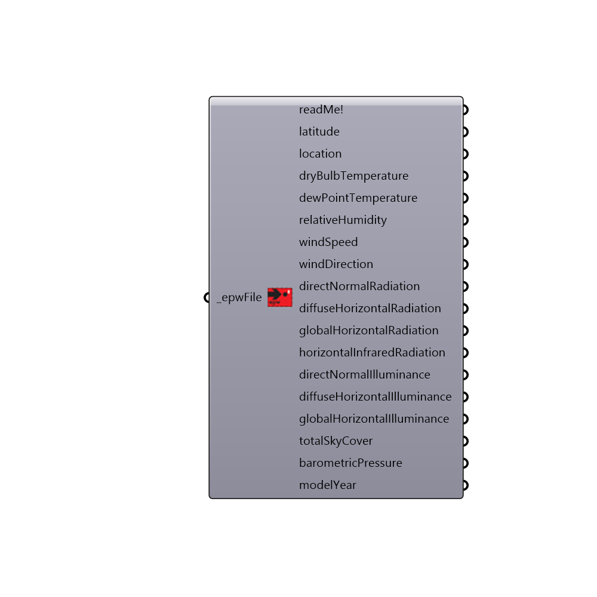

##  Import epw

Use this component to import lists of weather data into Grasshopper from a standard .epw file.
 For detailed information about the structure of an epw file, you may want to read the
 "Weather Converter Program" section in "Auxiliary EnergyPlus Programs" document.
 All descriptions of importaed data are borrowed from this document.
 The document is available online at this address:
 http://bigladdersoftware.com/epx/docs/8-3/auxiliary-programs/energyplus-weather-file-epw-data-dictionary.html
 -
 

#### Inputs
* ##### epwFile [Required]
An .epw file path on your system as a string.

#### Outputs
* ##### readMe!
...
* ##### latitude
The latitude of the weather file location.
* ##### location
A list of text summarizing the location data in the weather file (use this to construct the sun path).
* ##### dryBulbTemperature
"This is the houlry dry bulb temperature, in C. Note that this is a full numeric field (i.e. 23.6) and not an integer representation with tenths. Valid values range from 70 C to 70 C. Missing value for this field is 99.9."
* ##### dewPointTemperature
"This is the hourly dew point temperature, in C. Note that this is a full numeric field (i.e. 23.6) and not an integer representation with tenths. Valid values range from 70 C to 70 C. Missing value for this field is 99.9."
* ##### relativeHumidity
"This is the hourly Relative Humidity in percent. Valid values range from 0% to 110%. Missing value for this field is 999."
* ##### windSpeed
"This is the hourly wind speed in m/sec. Values can range from 0 to 40. Missing value is 999."
* ##### windDirection
"This is the hourly Wind Direction in degrees where the convention is that North=0.0, East=90.0, South=180.0, West=270.0. (If wind is calm for the given hour, the direction equals zero.) Values can range from 0 to 360. Missing value is 999."
* ##### directNormalRadiation
"This is the hourly Direct Normal Radiation in Wh/m2. (Amount of solar radiation in Wh/m2 received directly from the solar disk on a surface perpendicular to the sun's rays, during the number of minutes preceding the time indicated.) If the field is missing ( 9999) or invalid (<0), it is set to 0. Counts of such missing values are totaled and presented at the end of the runperiod."
* ##### diffuseHorizontalRadiation
"This is the hourly Diffuse Horizontal Radiation in Wh/m2. (Amount of solar radiation in Wh/m2 received from the sky (excluding the solar disk) on a horizontal surface during the number of minutes preceding the time indicated.) If the field is missing ( 9999) or invalid (<0), it is set to 0. Counts of such missing values are totaled and presented at the end of the runperiod."
* ##### globalHorizontalRadiation
"This is the hourly Global Horizontal Radiation in Wh/m2. (Total amount of direct and diffuse solar radiation in Wh/m2 received on a horizontal surface during the number of minutes preceding the time indicated.) It is not currently used in EnergyPlus calculations. It should have a minimum value of 0; missing value for this field is 9999."
* ##### horizontalInfraredRadiation
Script variable importEPW
* ##### directNormalIlluminance
"This is the hourly Direct Normal Illuminance in lux. (Average amount of illuminance in hundreds of lux received directly from the solar disk on a surface perpendicular to the sun's rays, during the number of minutes preceding the time indicated.) It is not currently used in EnergyPlus calculations. It should have a minimum value of 0; missing value for this field is 999999 and will be considered missing of >= 999900."
* ##### diffuseHorizontalIlluminance
"This is the hourly Diffuse Horizontal Illuminance in lux. (Average amount of illuminance in hundreds of lux received from the sky (excluding the solar disk) on a horizontal surface during the number of minutes preceding the time indicated.) It is not currently used in EnergyPlus calculations. It should have a minimum value of 0; missing value for this field is 999999 and will be considered missing of >= 999900."
* ##### globalHorizontalIlluminance
"This is the hourly Global Horizontal Illuminance in lux. (Average total amount of direct and diffuse illuminance in hundreds of lux received on a horizontal surface during the number of minutes preceding the time indicated.) It is not currently used in EnergyPlus calculations. It should have a minimum value of 0; missing value for this field is 999999 and will be considered missing of >= 999900."
* ##### totalSkyCover
"This is the fraction for total sky cover (tenths of coverage). (i.e. 1 is 1/10 covered. 10 is total coverage). (Amount of sky dome in tenths covered by clouds or obscuring phenomena at the hour indicated at the time indicated.) Minimum value is 0; maximum value is 10; missing value is 99."
* ##### barometricPressure
"This is the hourly weather station pressure in Pa. Valid values range from 31,000 to 120,000... Missing value for this field is 999999."
* ##### modelYear
The year from which the hourly data has been extracted. EPW files are synthesized from real recorded data from different years in a given climate. This is done to ensure that, for each month, the selected data is statistically representative of the average monthly conditions over the 18+ years of recording the data. Different EPW files will be synthesized from different years depeding on whether they are TMY (Typical Meteorological Year), TMY2, TMY3, AMY (Actual Meteorological Year) or other.

[Check Hydra Example Files for Import epw](https://hydrashare.github.io/hydra/index.html?keywords=Ladybug_Import epw)