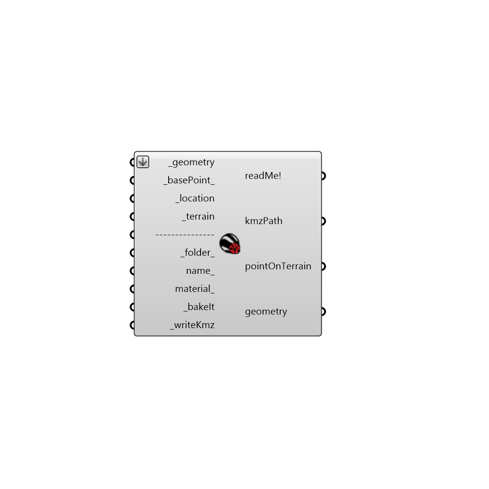

##  Kmz Generator

Use this component to export geometries into an Google Earth file.
 It requires Google Earth. You can download it at this link: https://www.google.it/earth/download/ge/agree.html
 Once you open kmz file you can continue to update it. This is useful when you change geometries or you want to compare different scenarios.
 .
 Updating: Just setting again to "True" _writeKmz, after that right click and select "update" on Google Earth.
 -
 Special thanks goes to Google and the authors of gHowl.
 -
 

#### Inputs
* ##### geometry [Required]
A list of Breps, Meshes and Surfaces to export.
* ##### basePoint [Required]
Input a point here to georeference the model.
* ##### basePointGeo [Required]
It accepts two type of inputs. 
 a) latitude, longitude and elevation that represent WSG84 coordinates of the base point. You can achieve these type of coordinates from Google Maps or similar.
 e.g. 40.821796, 14.426439, 990
 -
 b) location, you can obtain this type of input from "Ladybug_Construct Location", "Ladybug_Location Finder", "Ladybug_Import epw", "Ladybug_Import Location".
* ##### terrain [Required]
Connect the terrain output of "Ladybug_Terrain Generator" to move the geometries in the right altitude automatically.
* ##### name [Optional]
The kmz file name that you would like the image to be saved as.
* ##### material [Optional]
Connect Create Material component of Grasshopper, it is part of Display tab. If not supplied it will be default material.
* ##### bakeIt [Required]
Connect a Grasshopper button. Set to "True" to bake the geometries for Google Earth.
* ##### writeKmz [Required]
Connect a Boolean Toggle. After the baking, set it to "True" to export from Rhino Model to KMZ format.

#### Outputs
* ##### readMe!
...
* ##### pointOnTerrain
Script variable KmzGenerator
* ##### geometry
geometries on the ground.

[Check Hydra Example Files for Kmz Generator](https://hydrashare.github.io/hydra/index.html?keywords=Ladybug_Kmz Generator)