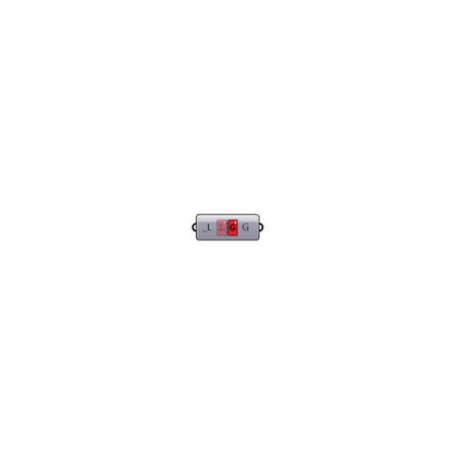

##  L2G

Use this component to convert the liquid volume from Liters to U.S. Gallons (not Imperial Gallons).
 -
 

#### Inputs
* ##### L [Required]
A value or list of values in Liters.

#### Outputs
* ##### G
Input volume converted to U.S. Gallons.

[Check Hydra Example Files for L2G](https://hydrashare.github.io/hydra/index.html?keywords=Ladybug_L2G)