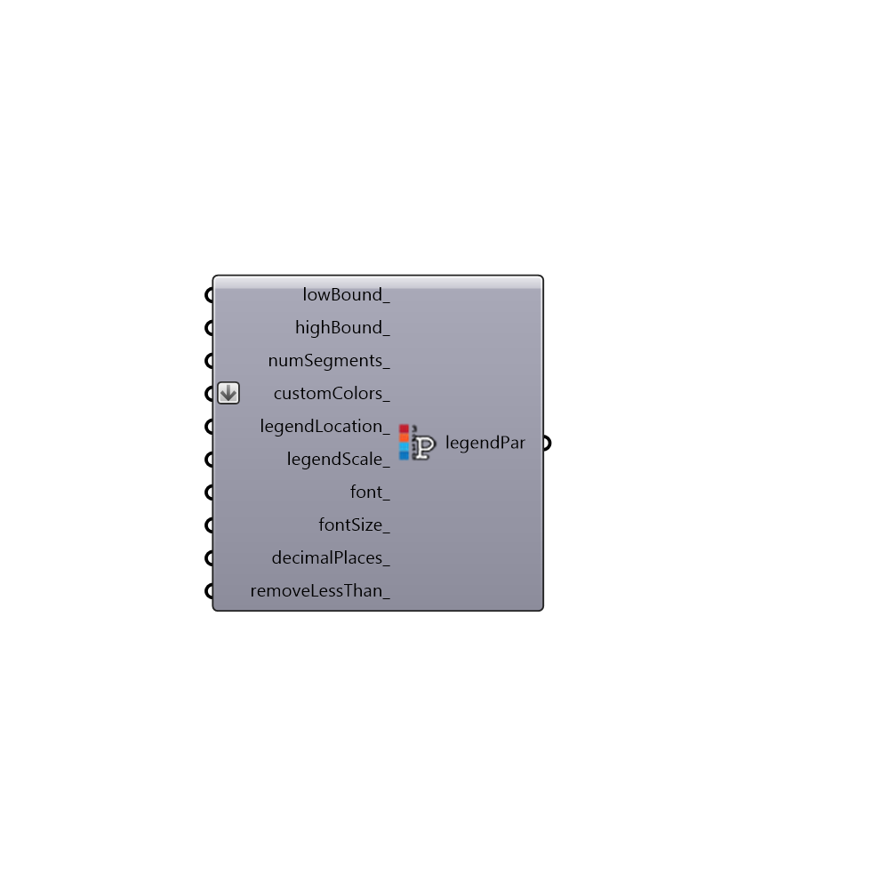

##  Legend_Parameters

Use this component to change the colors, numerical range, and/or number of divisions of any Ladybug legend along with the corresponding colored mesh that the legend refers to.
 This component can also move a legend and change its scale.
 Any Ladybug component that outputs a colored mesh and a legend will have an input that can accept Legend Parameters from this component.
 This component particularly helpful in making the colors of Ladybug graphics consistent for a presentation or for synchonizing the numerical range and colors between Ladybug graphics.
 -
 

#### Inputs
* ##### lowBound [Optional]
A number representing the lower boundary of the legend's numerical range.  The default is set to the lowest value of the data stream that the legend refers to.
* ##### highBound [Optional]
A number representing the higher boundary of the legend's numerical range. The default is set to the highest value of the data stream that the legend refers to.
* ##### numSegments [Optional]
An interger representing the number of steps between the high and low boundary of the legend.  The default is set to 11 and any custom values put in here should always be greater than or equal to 2.
* ##### customColors [Optional]
A list of colors that will be used to re-color the legend and the corresponding colored mesh(es).  The number of colors input here should match the numSegments_ value input above.  An easy way to generate a list of colors to input here is with the Grasshopper "Gradient" component and a Grasshopper "Series" component connected to the Gradient component's "t" input.  A bunch of Grasshopper "Swatch" components is another way to generate a list of custom colors.  The default colors are a gradient spectrum from blue to yellow to red.
* ##### legendLocation [Optional]
Input a point here to change the location of the legend in the Rhino scene.  The default is usually set to the right of the legend's corresponding Ladybug graphic.
* ##### legendScale [Optional]
Input a number here to change the scale of the legend in relation to its corresponding Ladybug graphic.  The default is set to 1.
* ##### font [Optional]
An optional text string that sets the font of the text. Examples include "Arial", "Times New Roman" or "Courier" (all without quotations).  The text input here can be any font that is on your computer but the font must be of an Editable file type (as seen in the font folder off of your control panel).  Font files that are Print and Preview will not work.
* ##### fontSize [Optional]
An optional number to set the size of the text in Rhino model units.
* ##### bold [Optional]
Set to 'True' to have the text be bolded and set to 'False' to have it displayed in medium type face.  The default is set to 'False.'

#### Outputs
* ##### legendPar
A list of legend parameters to be plugged into any of the Ladybug components with a legend.

[Check Hydra Example Files for Legend Parameters](https://hydrashare.github.io/hydra/index.html?keywords=Ladybug_Legend Parameters)