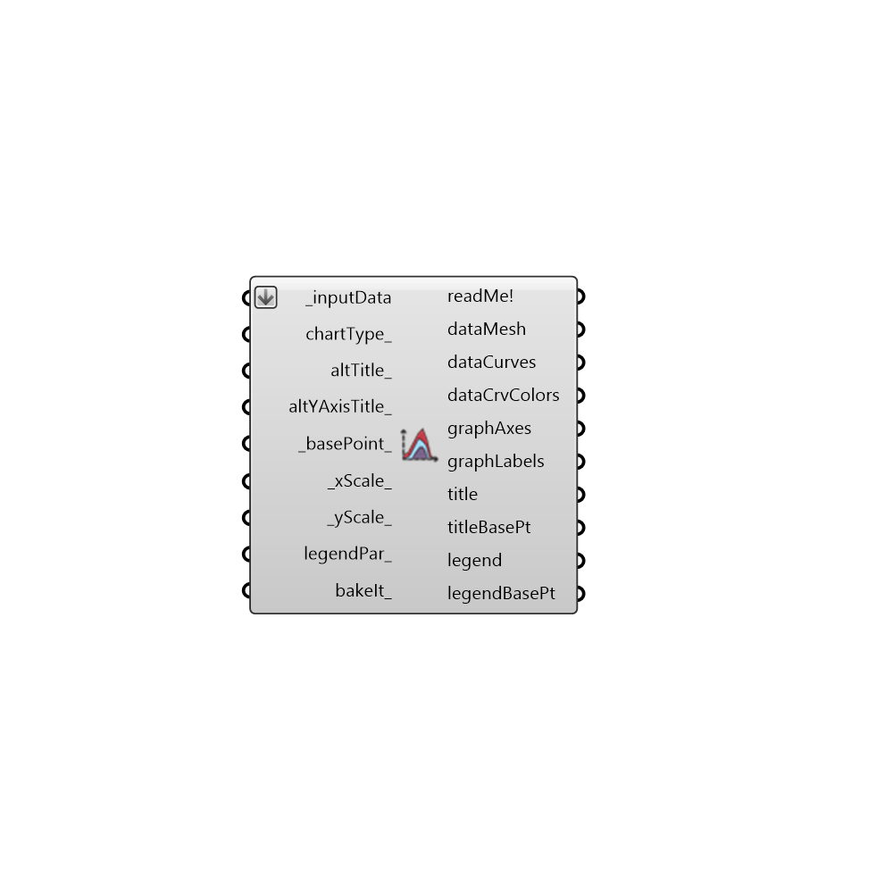

##  Line Chart - [[source code]](https://github.com/ladybug-tools/ladybug-legacy/tree/master/src/Ladybug_Line%20Chart.py)

Use this component to make a line chart in the Rhino scene of any data with a ladybug header on it.
 -
 

#### Inputs
* ##### inputData [Required]
A list of input data to plot.  This should usually be data out of the "Ladybug_Average Data" component or monthly data from an energy simulation but can also be hourly or daily data from the "Ladybug_Import EPW."  However, it is recommended that you use the "Ladybug_3D Chart" component for daily or hourly data as this is usually a bit clearer.
* ##### chartType [Optional]
An integer that sets the type of chart that will be drawn.  Choose from the following options:
 0 = Normal - Data will be plotted as polylines right next to each other.
 1 = Stacked - Data will be plotted as lines stacked on top of one another.
 2 = Stacked Area - Data will be plotted as filled areas stacked on top of one another.
* ##### altTitle [Optional]
An optional text string to replace the default title of the chart of the chart.  The default is set to pick out the location of the data connected to 'inputData.'
* ##### altYAxisTitle [Optional]
An optional text string to replace the default Y-Axis label of the chart.  This can also be a list of 2 y-axis titles if there are two different types of data connected to _inputData.  The default is set to pick out the names of the first (and possibly the second) list connected to the 'inputData.'
* ##### basePoint [Default]
An optional point with which to locate the 3D chart in the Rhino Model.  The default is set to the Rhino origin at (0,0,0).
* ##### xScale [Default]
The scale of the X axis of the graph. The default is set to 1 and this will plot the X axis with a length of 120 Rhino model units (for 12 months of the year).
* ##### yScale [Default]
The scale of the Y axis of the graph. The default is set to 1 and this will plot the Y axis with a length of 50 Rhino model units.
* ##### legendPar [Optional]
Optional legend parameters from the Ladybug Legend Parameters component.
* ##### bakeIt [Optional]
An integer that tells the component if/how to bake the bojects in the Rhino scene.  The default is set to 0.  Choose from the following options:
 0 (or False) - No geometry will be baked into the Rhino scene (this is the default).
 1 (or True) - The geometry will be baked into the Rhino scene as a colored hatch and Rhino text objects, which facilitates easy export to PDF or vector-editing programs.
 2 - The geometry will be baked into the Rhino scene as colored meshes, which is useful for recording the results of paramteric runs as light Rhino geometry.

#### Outputs
* ##### readMe!
...
* ##### dataMesh
A list of meshes that represent the different input data.
* ##### dataCurves
A list of curves that represent the different input data.
* ##### dataCrvColors
A list of colors that correspond to the dataCurves above.  Hook this up to the 'swatch' input of the native Grasshopper 'Preview' component and the curves above up to the 'geometry input to preview the curves with their repective color.
* ##### graphAxes
A list of curves representing the axes of the chart.
* ##### graphLabels
A list of text meshes representing the time periods corresponding to the input data
* ##### title
A title for the chart.  By default, this is just the location of the data but you can input a custom title with the altTitle_ input.
* ##### titleBasePt
The title base point, which can be used to move the title in relation to the chart with the grasshopper "move" component.
* ##### legend
A legend of the chart that tells what each connected data stram's color is. Connect this output to a grasshopper "Geo" component in order to preview the legend in the Rhino scene.
* ##### legendBasePt
The legend base point, which can be used to move the legend in relation to the chart with the grasshopper "move" component.

[Check Hydra Example Files for Line Chart](https://hydrashare.github.io/hydra/index.html?keywords=Ladybug_Line Chart)