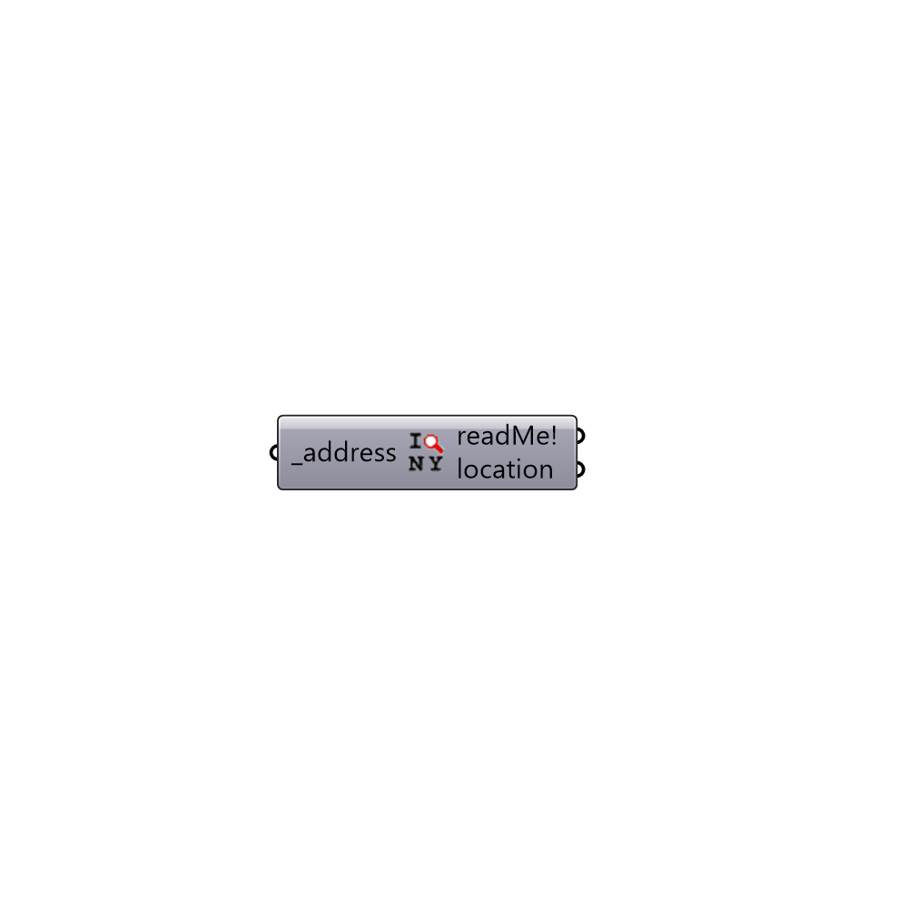

##  Location Finder - [[source code]](https://github.com/mostaphaRoudsari/ladybug/tree/master/src/Ladybug_Location%20Finder.py)

This component uses Google Maps API to generate locations.
 -
 This component requires an internet connection and a secure connection (HTTPS), it runs for free up to 2,500 requests per day. Once you go over this limit the component doesn't work.
 For informations about the rules of use of Google Maps API, take a look at this link:
 https://developers.google.com/maps/pricing-and-plans/#details
 -
 Special thanks goes to Google Maps.
 -
 

#### Inputs
* ##### address [Required]
Write a location address. For example,
 -
 'Colosseum, Rome'    OR
 .
 'Colosseum, Piazza del Colosseo, 1, 00184 Roma, Italy'

#### Outputs
* ##### readMe!
...
* ##### location
A list of text summarizing the location data in the weather file (use this to construct the sun path).

[Check Hydra Example Files for Location Finder](https://hydrashare.github.io/hydra/index.html?keywords=Ladybug_Location Finder)