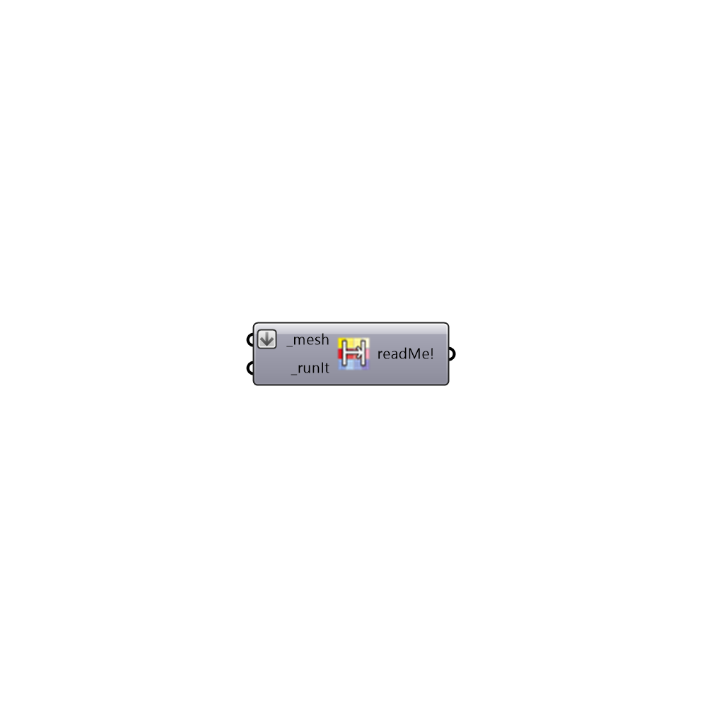

##  Mesh-To-Hatch - [[source code]](https://github.com/mostaphaRoudsari/ladybug/tree/master/src/Ladybug_Mesh-To-Hatch.py)

Use this component to bake a clored mesh into the Rhino scene as a series of colored hatches.  This is particularly useful if you are trying to export ladybug graphics from Rhino to vector-based programs like Inkscape or Illustrator.
 -
 

#### Inputs
* ##### mesh [Required]
A colored mesh (or list of colored meshes) that you would like to bake into the Rhino scene as a series of colored hatches.
* ##### runIt [Required]
Set to 'True' to run to run the component and bake the mesh into the scene as a series of hatches.

#### Outputs
* ##### readMe!
...

[Check Hydra Example Files for Mesh-To-Hatch](https://hydrashare.github.io/hydra/index.html?keywords=Ladybug_Mesh-To-Hatch)