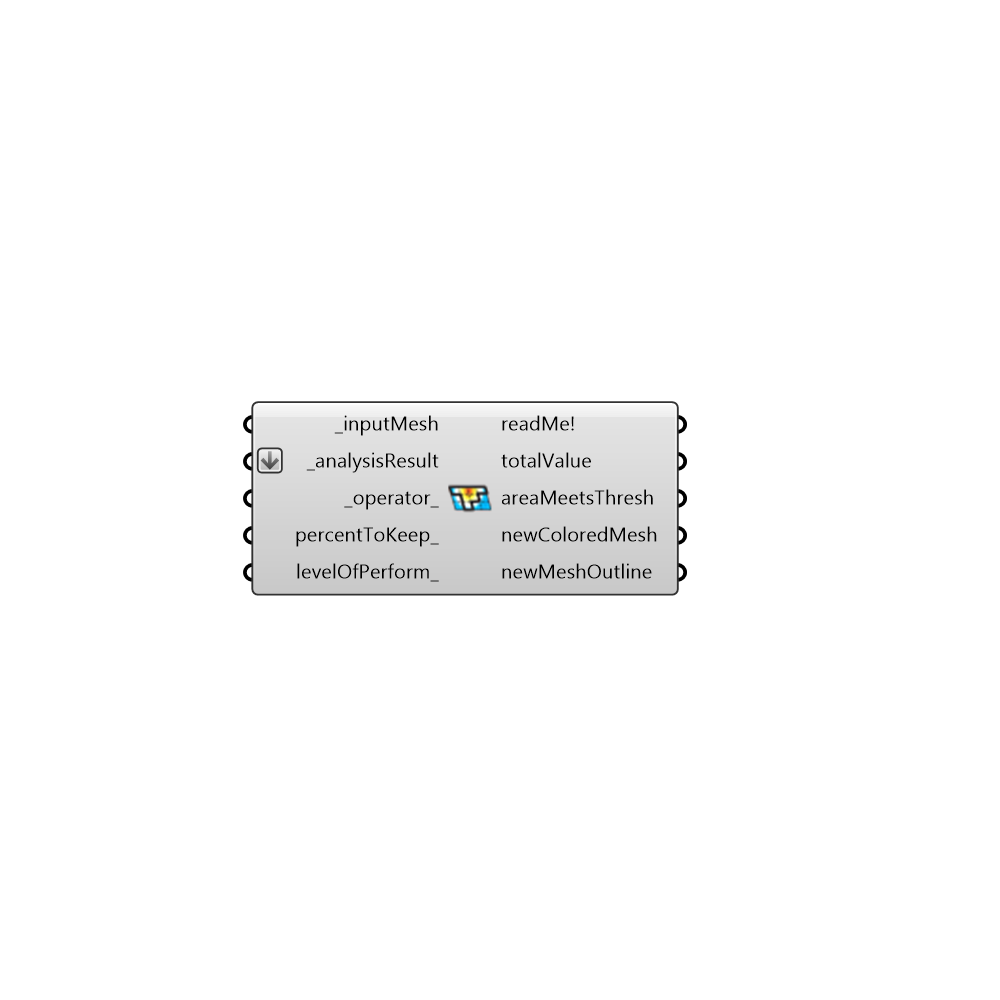

##  Mesh Threshold Selector - [[source code]](https://github.com/ladybug-tools/ladybug-legacy/tree/master/src/Ladybug_Mesh%20Threshold%20Selector.py)

Use this component to select out the part of a colored mesh that meets a certain conditional statement.  This has multiple uses: The generation of a custom shade from a shade benefit analysis, Quantifying the daylight area from a daylight analysis, Selecting out the portion of a roof with enough solar radiation for PV panels, and much more.
 -
 

#### Inputs
* ##### inputMesh [Required]
The mesh for which you would like to highlight the portion that meets a threshold.
* ##### analysisResult [Required]
A numerical data set whose length corresponds to the number of faces in the _inputMesh.
* ##### operator [Default]
A text string representing an operator for the the conditional statement.  The default is set to be greater than (>).  This must be an operator in python and examples include:
 > - Greater Than
 < - Less Than
 >= - Greater or Equal
 <= - Less or Equal
 == - Equals
* ##### percentToKeep [Optional]
A number between 0 and 100 that represents the percentage of the mesh faces that you would like to include in the resulting newColoredMesh.  By default, this is set to 25%.
* ##### levelOfPerform [Optional]
An optional number that represents the threshold above which a given mesh face is included in the newColoredMesh.  An input here will override the percent input above.

#### Outputs
* ##### readMe!
...
* ##### totalValue
The sum of all of the values that meet the criteria multiplied by the mesh face area.  For example, if the _inputMesh is a radiation study mesh, this is equal to the total radiation falling on the newColoredMesh.  For an energy shade benefit mesh, this is the total energy saved by a shade of this size.
* ##### areaMeetsThresh
The area of the newColoredMesh in Rhino model units.
* ##### newColoredMesh
A new colored mesh with the vlues below the threshold deleted out of it.
* ##### newMeshOutline
A set of curves outlining the portion of the mesh that is above the threshold.

[Check Hydra Example Files for Mesh Threshold Selector](https://hydrashare.github.io/hydra/index.html?keywords=Ladybug_Mesh Threshold Selector)