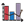
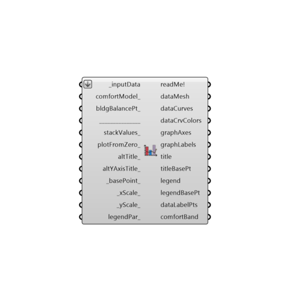

##  Monthly Bar Chart

Use this component to make a bar chart in the Rhino scene of any monhtly or avrMonthyPerHour climate data or simulation data.
 _
 This component can also plot daily or hourly data but, for visualizing this type of data, it is recommended that you use the "Ladybug_3D Chart" component.
 -
 

#### Inputs
* ##### inputData [Required]
A list of input data to plot.  This should usually be data out of the 'Ladybug_Average Data' component or monthly data from an energy simulation but can also be hourly or daily data from the 'Ladybug_Import EPW.'  However, it is recommended that you use the 'Ladybug_3D Chart' component for daily or hourly data as this is usually a bit clearer.
* ##### comfortModel [Optional]
An optional interger to draw the comfort model on the chart.  Choose from the following:   0 - No comfort range   1 - PMV comfort range (indoor)   2 - Adaptive confort range (naturally ventilated)   3 - UTCI Comfort (outdoor)   Note that this option is only available when temperature is connected so, by default, it is set to 0 for no comfort range.
* ##### bldgBalancePt [Optional]
An optional float value to represent the outdoor temperature at which the energy passively flowing into a building is equal to that flowing out of the building.  This is usually a number that is well below the comfort temperture (~ 12C - 18C) since the internal heat of a building and its insulation keep the interior warmer then the exterior.  However, by default, this is set to 23.5C for fully outdoor conditions.
* ##### stackValues [Optional]
Set to 'True' if you have multiple connected monthly or daily _inputData with the same units and want them to be drawn as bars stacked on top of each other.  Otherwise, all bars for monthly/daily data will be placed next to each other.  The default is set to 'False' to have these bars placed next to each other.
* ##### plotFromZero [Optional]
Set to 'True' to have the component plot all bar values starting from zero (as opposed from the bottom of the chart, which might be a negative number).  This is useful when you are plotting the terms of an energy balance where you want gains to be above zero and losses to be below.  It can be detrimental if you are plotting temperatures in degrees celcius and do not want negative values to go below zero.  As such, the default is set to 'False' to not plot from zero.
* ##### altTitle [Optional]
An optional text string to replace the default title of the chart of the chart.  The default is set to pick out the location of the data connected to 'inputData.'
* ##### altYAxisTitle [Optional]
An optional text string to replace the default Y-Axis label of the chart.  This can also be a list of 2 y-axis titles if there are two different types of data connected to _inputData.  The default is set to pick out the names of the first (and possibly the second) list connected to the 'inputData.'
* ##### basePoint [Default]
An optional point with which to locate the 3D chart in the Rhino Model.  The default is set to the Rhino origin at (0,0,0).
* ##### xScale [Default]
The scale of the X axis of the graph. The default is set to 1 and this will plot the X axis with a length of 120 Rhino model units (for 12 months of the year).
* ##### yScale [Default]
The scale of the Y axis of the graph. The default is set to 1 and this will plot the Y axis with a length of 50 Rhino model units.
* ##### legendPar [Optional]
Optional legend parameters from the Ladybug Legend Parameters component.

#### Outputs
* ##### readMe!
...
* ##### dataMesh
A series of meshes that represent the different monthly (or daily) input data.  Multiple lists of meshes will be output for several input data streams.
* ##### dataCurves
A list of curves that represent the different avrMonthyPerHour and hourly input data. Multiple lists of curves will be output for several input data streams.
* ##### dataCrvColors
A list of colors that correspond to the dataCurves above.  Hook this up to the 'swatch' input of the native Grasshopper 'Preview' component and the curves above up to the 'geometry input to preview the curves with their repective color.
* ##### graphAxes
A list of curves representing the axes of the chart.
* ##### graphLabels
A list of text meshes representing the time periods corresponding to the input data
* ##### title
A title for the chart.  By default, this is just the location of the data but you can input a custom title with the altTitle_ input.
* ##### titleBasePt
The title base point, which can be used to move the title in relation to the chart with the grasshopper "move" component.
* ##### legend
A legend of the chart that tells what each connected data stram's color is. Connect this output to a grasshopper "Geo" component in order to preview the legend in the Rhino scene.
* ##### legendBasePt
The legend base point, which can be used to move the legend in relation to the chart with the grasshopper "move" component.
* ##### dataLabelPts
A series of points that mark where each of the bars or lines of the chart lie.  You can use this to label the bars or lines with numerical values using a native grasshopper "text tag" component and the data that you have connected to the _inputData of this component.
* ##### comfortBand
A series of meshes that represent the comfort range in each month according to the input comfortModel_.

[Check Hydra Example Files for Monthly Bar Chart](https://hydrashare.github.io/hydra/index.html?keywords=Ladybug_Monthly Bar Chart)