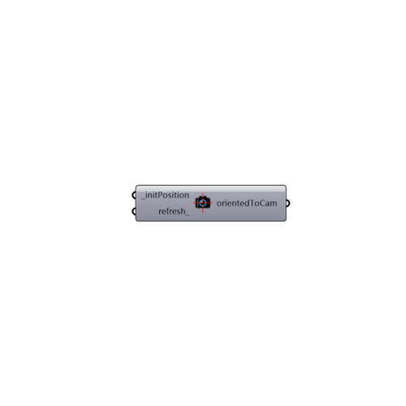

##  Orient to Camera

Use this component to generate a plane that is oriented perpendicular to the active Rhino viewport camera direction and centered at an input _initPosition point.
 This is useful for orienting geometry Grasshopper to the Rhino viewport camera, which may help in presenting certain Ladybug visualizations in Rhino.
 Connect a Grasshopper "Timer" component to the refresh_ input of this component in order to get a real time update of the oriented plane based on the Rhino viewport camera direction.
 -
 

#### Inputs
* ##### initPosition [Required]
A point or list of points that will act as the origin9s0 of the plane(s) that will be generated.
* ##### refresh [Optional]
Connect either a Grasshopper "button" component that will allow you to refresh the plane orientation upon hitting the button or a Grasshopper "Timer" component to see the plane update in real time as you navigate through the Rhino viewport.

#### Outputs
* ##### orientedToCam
A plane (or list of planes) for each _initPosition connected. All planes are oriented perpendicular to the active Rhino viewport camera direction and are centered at initPosition points.

[Check Hydra Example Files for Orient to Camera](https://hydrashare.github.io/hydra/index.html?keywords=Ladybug_Orient to Camera)